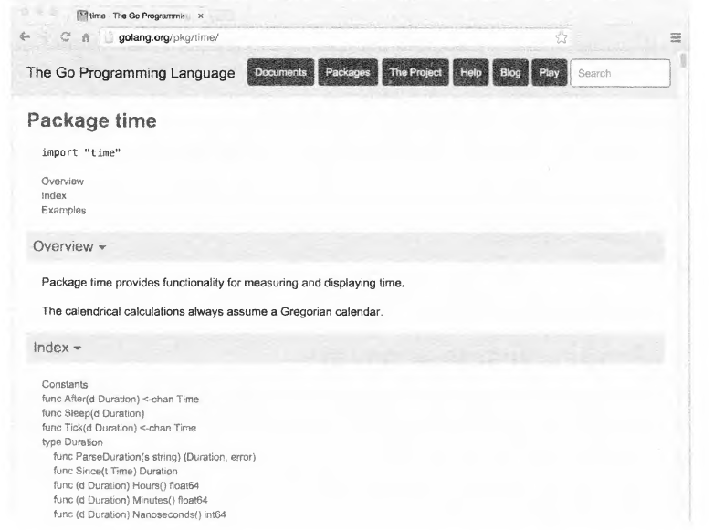

# 10.7.4. Документирование пакетов

Стиль Go настоятельно рекомендует тщательно документировать API пакетов. Непосредственно каждому объявлению
экспортируемого члена пакета и самому объявлению пакета должен предшествовать комментарий, объясняющий его цель и
использование.

`Документирующие комментарии` Go всегда являются полными предложениями, и первое предложение обычно представляет собой
резюме, которое начинается с объявляемого имени. Параметры функции и другие идентификаторы упоминаются без кавычек.
Например, вот как выглядит документирующий комментарий для `fmt.Fprintf`:

``` go
// Fprintf выполняет форматирование согласно спецификатору формата и 
// запись в w. Возвращает количество записанных байтов и произошедшую 
// ошибку записи.
func Fprintf(w io.Writer, format string, a ...interface{}) (int, error)
```

Детальная информация о форматировании функцией `Fprintf` разъясняется в документирующем комментарии самого пакета `fmt`.
Комментарий, непосредственно предшествующий объявлению `package`, рассматривается как документирующий комментарий пакета
в целом. Он должен быть только один, хотя может находиться в любом файле. Более длинный комментарий пакета может
потребовать собственного файла; комментарий пакета `fmt` состоит более чем из 300 строк. Этот файл обычно
называется `doc.go.`

Хорошая документация не должна быть большой. Соглашения Go отдают предпочтение **краткости и простоте в документации**,
как и во всем прочем, поскольку документация, как и код, также требует обслуживания. Многие объявления могут быть
объяснены одним четко сформулированным предложением, а если поведение совершенно очевидно, комментарии не являются
необходимыми. Там, где в книге позволяло место, мы оставляли документирующие комментарии перед объявлениями, но вы
можете найти куда лучшие примеры в стандартной библиотеке. Помочь вам сделать это могут два инструмента.
Инструмент `go doc` **выводит объявление и документирующий комментарий для объекта**, указанного в командной строке. Он
может быть пакетом:

``` shell
$ go doc time
package time // import "time"
Пакет time предоставляет функциональность для измерения и вывода времени.

const Nanosecond Duration = 1 ...
func After(d Duration) <- chan Time
func Sleep(d Duration)
func Since(t Time) Duration
func Now() Time
type Duration int64
type Time struct { ... }
... и т.д. ...
```

Или членом пакета:

``` shell
$ go doc time.Since
func Since(t Time) Duration
	Since возвращает время, прошедшее с момента t.
	Это аббревиатура для time.Now().Sub(t).
```

Или методом:

``` shell
$ go doc time.Duration.Seconds 
func (d Duration) Seconds() float64
	Seconds возвращает продолжительность в виде числа 
	секунд с плавающей точкой.
```

Инструмент не требует завершения путей импорта или корректного регистра идентификаторов. Приведенная далее команда
выводит документацию по `(*json. Decoder).Decode` из пакета `encoding/json`:

``` shell
$ go doc json.decode
func (dec *Decoder) Decode(v interface{}) error
	Decode считывает очередное JSON-кодированное значение из входа 
	и сохраняет его в значении, на которое указывает v.
```

Второй инструмент, не совсем верно названный `godoc`, предоставляет связанные HTML-страницы, которые содержат ту же
информацию, что и `go doc`, а также многое другое. Сервер `godoc` по адресу https://golang.org/pkg охватывает
стандартную библиотеку. На рис. 10.1 показана документация для пакета time, а в разделе 11.6 — интерактивный вывод
примеров программ инструментом `godoc`. Сервер `godoc` по адресу https://godoc.org снабжен поиском в тысячах пакетов с
открытым кодом.



Можно запустить экземпляр `godoc` в вашей рабочей области, чтобы просматривать собственные пакеты. После запуска
приведенной ниже команды посетите адрес http://localhost:8000/pkg с помощью своего браузера.

``` shell
$ godoc -http:8000
```

Флаги `-analysis=type` и `-analysis=pointer` дополняют документацию и исходный текст результатами `"продвинутого"`
статистического анализа.

## Выводы:

* Стиль Go настоятельно рекомендует тщательно документировать API пакетов; она помогает пользователям легче разобраться
  в предназначении и использовании пакетов;
* Каждое объявление **экспортируемого члена пакета** и **самого объявления пакета** должны сопровождаться комментарием,
  объясняющим их цель и использование;
* Документирующие комментарии Go являются **полными предложениями**, начинающимися с имени объявления, объясняющим его
  назначение;
* Пакетное объявление должно иметь только один документирующий комментарий, который может находиться в любом файле или в
  отдельном файле под названием `doc.go`;
* Важно стремиться к краткости и простоте в документации, поскольку как и код, она также **требует обслуживания**;
* Инструмент `go doc` выводит документирующие комментарии для указанных объектов, пакетов или членов пакета, что
  облегчает работу с документацией;
* Инструмент `godoc` предоставляет HTML-страницы с документацией, которые можно просматривать через браузер или
  запустить на локальном сервере для просмотра собственных пакетов;
* Польза от использования тщательной документации заключается в упрощении процесса обучения для новичков, быстром
  разборе в коде для опытных разработчиков и улучшении общего качества кода.