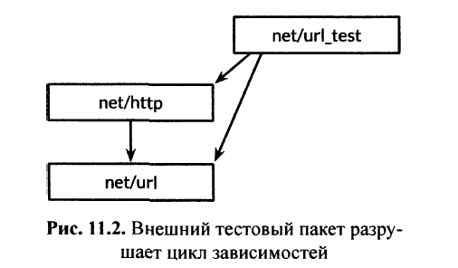

# 11.2.4. Внешние тестовые пакеты

Рассмотрим пакеты `net/url`, которые предоставляет анализатор URL, и `net/ http`, который обеспечивает веб-сервер и
клиентскую библиотеку HTTP. Как мы могли бы ожидать, более высокоуровневый пакет `net/http` зависит от пакета более
низкого уровня `net/url`. Однако один из тестов в `net/url` представляет собой пример, демонстрирующий взаимодействие
между **URL и клиентской библиотекой HTTP**. Другими словами, тест пакета нижнего уровня импортирует пакет более
высокого уровня.


Объявление этой тестовой функции в пакете `net/url` будет создавать цикл в графе импорта пакетов, как показано стрелкой,
ведущей вверх на рис. 11.1, но, как мы говорили в разделе 10.1, спецификация Go **запрещает циклический импорт**.

Мы решаем эту проблему, объявляя тестирующую функцию во `внешнем тестовом пакете`, т.е. в файле в каталоге `net/url`,
объявление пакета которого выглядит как `package url_test`. Дополнительный суффикс `_test` является сигналом
для `go test` о том, что он **должен создать дополнительный пакет, содержащий только эти файлы, и выполнять его тесты**.
Можно рассматривать этот внешний тестовый пакет как пакет, который имеет путь импорта `net/url_test`, но не может быть
импортирован с этим или любым иным именем.

Поскольку `внешние тесты` находятся **в отдельном пакете**, они могут импортировать вспомогательные пакеты, которые
также зависят от пакета, который они тестируют; **обычный тестовый пакет на такое не способен**. С точки зрения
проектирования внешний тестовый пакет логически находится выше, чем оба пакета, от которых он зависит, как показано на
рис. 11.2.



Избегая циклов импорта, внешние тестовые пакеты позволяют тестам, в особенности `тестам интеграции (которые тестируют
взаимодействие нескольких компонентов)`, свободно импортировать другие пакеты так, как это делает приложение.
Мы можем использовать инструмент `go list`, чтобы выяснить, какие исходные файлы Go в каталоге пакета являются рабочим
кодом, какие — тестами в текущем пакете, а какие — внешними тестами. В качестве примера воспользуемся
пакетом `fmt.GoFiles` представляет собой список файлов, которые содержат рабочий код; это файлы, которые `go build`
будет включать в приложение:

``` shell
$ go list -f={{.GoFiles}} fmt 
[doc.go format.go print.go scan.go]
```

`TestGoFiles` представляет собой список файлов, которые также принадлежат пакету `fmt`, но эти файлы, имена которых
оканчиваются как `_test.go`, включаются только при построении тестов:

``` shell
$ go list -f={{.TestGoFiles}} fmt 
[export_test.go]
```

В таких файлах обычно располагаются тесты пакета, так что их отсутствие в пакете `fmt` необычно; назначение файла
`export_test.go` мы вскоре поясним.

`XTestGoFiles` представляет собой список файлов, которые составляют пакет внешнего тестирования, `fmt_test`, так что эти
файлы должны импортировать пакет `fmt` для того, чтобы его использовать. Они также включаются в построение только в
процессе тестирования:

``` shell
$ go list -f={{.XTestGoFiles}} fmt 
[fmt_test.go scan_test.go stringer_test.go]
```

Иногда пакету внешнего тестирования может потребоваться привилегированный доступ к внутреннему представлению
тестируемого пакета, если, например, **тест белого ящика должен находиться в отдельном пакете во избежание цикла импорта
**. В таких случаях мы используем следующий трюк: **добавляем объявления в файл** `_test.go` в тестируемом пакете для
предоставления необходимого внутреннего представления внешнему тесту. Таким образом, этот файл, по сути, представляет
собой “**черный ход**” в пакет. Если исходный файл существует только для этой цели и не содержит тестов, его часто
называют `export_test.go.`

Например, реализации пакета `fmt` требуется функциональность `Unicode`. `IsSpace` — как часть `fmt.Scanf`. Чтобы
избежать
создания нежелательных зависимостей, `fmt` не импортирует пакет `Unicode` и его большие таблицы данных; вместо этого он
содержит более простую реализацию, которая называется `isSpace`.

Чтобы обеспечить согласованность поведения `fmt.isSpace` и `Unicode.IsSpace`, `fmt` предусмотрительно содержит тест. Это
**внешнее тестирование**, и, таким образом, оно **не может получить доступ** к `isSpace` непосредственно. Поэтому `fmt`
открывает черный ход к этой функции путем объявления экспортируемой переменной, которая содержит внутреннюю
функцию `isSpace`. В этом и состоит весь файл `export_test.go` пакета `fmt`.

``` go
package fmt
var IsSpace = isSpace
```

Этот тестовый файл **не определяет никаких тестов**; он просто объявляет экспортируемый символ `fmt.IsSpace` для
использования внешним тестированием. Этот трюк может также использоваться всякий раз, когда внешнему тестированию
необходимо использовать некоторые из методов тестирования белого ящика.

## Выводы:

* Внешние тестовые пакеты позволяют обойти **циклические импорты** и **проводить тесты между пакетами разного уровня**;
  это полезно для `интеграционных тестов`, которые проверяют взаимодействие между компонентами;
* `Внешние тестовые пакеты` объявляются в отдельном файле с суффиксом `_test` в имени пакета, что позволяет `go test`
  идентифицировать этот пакет для тестирования;
* Можно использовать инструмент `go list` для определения типов файлов Go в каталоге пакета, например, объявления
  рабочего кода и внешних тестов;
* В некоторых случаях `внешним тестовым пакетам` может потребоваться привилегированный доступ к внутреннему
  представлению тестируемого пакета; для этого нужно использовать файл с суффиксом `_test.go` **внутри тестируемого
  пакета**, что позволяет "через черный ход" предоставить доступ к некоторым внутренним функциям;
* Файл `export_test.go` может использоваться для экспорта некоторых функций и переменных, доступных только для внешних
  тестов, тем самым обеспечивая согласованность поведения внутри и вне пакета;
* Использование внешних тестовых пакетов делает код проекта на языке Golang более модульным, упрощает процесс
  тестирования и повышает уровень контроля над доступом к внутренним объектам и функциям.