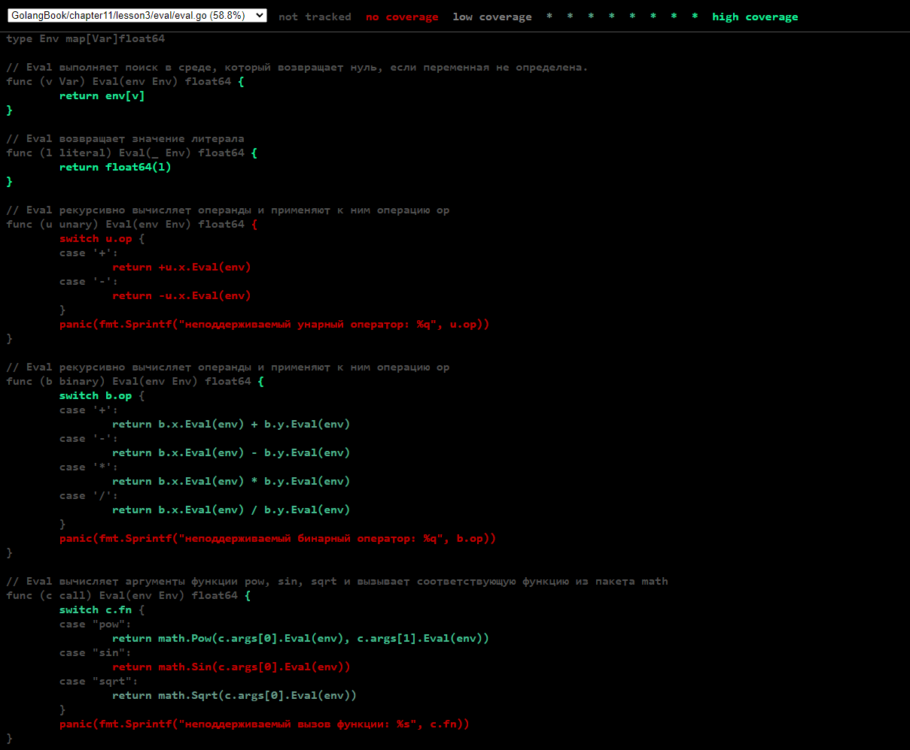

# 11.3. Охват

По своей природе тестирование никогда **не является полным**. Как выразился известный ученый-кибернетик Эдсгер
Дейкстра (Edsger Dijkstra), "тестирование показывает присутствие, не отсутствие ошибок". Никакое количество тестов не
может доказать отсутствие ошибок в пакете. В лучшем случае **они увеличивают нашу уверенность**, что этот пакет хорошо
работает в широком спектре важных сценариев.

Степень, до которой набор тестов исследует тестируемый пакет, называется `охватом теста (покрытие теста)`. Охват нельзя
непосредственно выразить количественно (динамика любых сколь-нибудь нетривиальных программ выходит за рамки точного
измерения), но имеются эвристики, которые могут помочь нам направить наши усилия по тестированию в том направлении, в
котором они окажутся наиболее полезными.

Самой простой и наиболее широко используемой среди этих эвристик является эвристика `охвата инструкций`. Охват
инструкций тестом представляет собой **долю инструкций в исходном коде, которые во время теста выполняются по крайней
мере один раз**. В этом разделе мы будем использовать инструмент Go `cover` (который интегрирован в `go test`), чтобы
измерить охват инструкций и выявить очевидные пробелы в тестах. Приведенный ниже код является табличным тестом для
вычислителя выражений, который мы строили в главе 7, “Интерфейсы” (см. eval):

``` go
func TestCoverage(t *testing.T) {
	var tests = []struct {
		input string
		env   Env
		want  string // Ожидаемая ошибка от Parse/Check или результат Eval
	}{
		{"x % 2", nil, "неожиданный символ '%'"},
		{"!true", nil, "неожиданный символ '!'"},
		{"log(10)", nil, `'неизвестная функция "log"`},
		{"sqrt(1, 2)", nil, "вызов sqrt с 2 аргументами, нужен 1"},
		{"sqrt(A / pi)", Env{"A": 87616, "pi": math.Pi}, "167"},
		{"pow(x, 3) + pow(y, 3)", Env{"x": 9, "y": 10}, "1729"},
		{"5 / 9 * (F - 32)", Env{"F": -40}, "-40"},
	}

	for _, test := range tests {
		expr, err := Parse(test.input)
		if err == nil {
			err = expr.Check(map[Var]bool{})
		}
		if err != nil {
			if err.Error() != test.want {
				t.Errorf("%s: получено %q, требуется %q", test.input, err, test.want)
			}
			continue
		}

		got := fmt.Sprintf("%.6g", expr.Eval(test.env))
		if got != test.want {
			t.Errorf("%s: %v => %s, want %s",
				test.input, test.env, got, test.want)
		}
	}
}
```

Сначала проверим, что тест пройден:

``` shell
go test -v -run=Coverage GolangBook/chapter11/lesson3/eval
=== RUN   TestCoverage
--- PASS: TestCoverage (0.00s)
PASS
ok      GolangBook/chapter11/lesson3/eval       0.205s
```

Следующая команда выводит сообщение об использовании инструмента охвата:

``` shell
go tool cover
Usage of 'go tool cover':
Given a coverage profile produced by 'go test':
        go test -coverprofile=c.out

Open a web browser displaying annotated source code:
        go tool cover -html=c.out
        
Использование 'go tool cover':
Профиль охвата, генерируемый ’go test': 
		go test -coverprofile=c.out
Открыть браузер, выводящий аннотированный исходный текст: 
		go tool cover -html=c.out
```

Команда `go tool` запускает один из выполнимых файлов инструментария Go. Эти программы находятся в каталоге
`$GOROOT/pkg/tool/${GOOS}_${GOARCH}`. Благодаря `go build` нам редко приходится обращаться к ним непосредственно.
Теперь запустим тест с флагом `-coverprofile`:

``` shell
go test -v -run=Coverage -coverprofile='cover.out' .\eval\ 
=== RUN   TestCoverage
--- PASS: TestCoverage (0.00s)
PASS
        GolangBook/chapter11/lesson3/eval       coverage: 76.4% of statements
ok      GolangBook/chapter11/lesson3/eval       0.225s  coverage: 76.4% of statements
```

Этот флаг включает сбор данных об охвате посредством `измерений (instrumenting)` производственного кода, т.е. он
**изменяет копию исходного кода** так, чтобы перед выполнением каждого блока инструкций устанавливалась некоторая булева
переменная, **по одной переменной на каждый блок**. Непосредственно перед выходом из измененной таким образом программы
значения всех переменных записываются в указанный журнальный файл `cover.out` и выводится итоговое значение доли
инструкций, которые были выполнены. (Если все, что вам нужно, — это итоговые значения, воспользуйтесь
командой `go test -cover`.)

``` shell
go test -cover .\eval\
ok      GolangBook/chapter11/lesson3/eval       0.216s  coverage: 76.4% of statements

```

Если запустить `go test` с флагом `-covermode=count`, при выполнении каждого блока вместо установки булева значения
будет увеличиваться соответствующий счетчик. В журнале будут указаны количественные величины для каждого блока, которые
позволят определить, какие блоки выполняются более часто, а какие — реже.

Собрав данные, мы можем запустить инструмент `cover`, который обрабатывает журнал, создает HTML-отчет и открывает его в
новом окне браузера (рис. 11.3):

``` shell
go tool cover -html='c.out'
```



Каждая инструкция окрашена либо в зеленый цвет, если она была охвачена, либо в красный, если не была (для ясности на
рисунке красный текст приведен на затененном фоне). Мы сразу же видим, что ни одни из наших входных данных не приводят к
вызову метода `Eval` унарного оператора. Если мы добавим в таблицу новый тестовый пример и вновь выполним две предыдущие
команды, код унарного выражения станет зеленым:

``` go
{"-х * -х", eval.Env{"x": 2}, "4"}
```

Однако две инструкции `panic` остаются красными. Это не должно быть удивительным, потому что предполагается, что данные
инструкции недоступны.

Достижение 100% охвата инструкций звучит как благородная цель, но обычно она **не осуществима на практике** и не
представляется разумной тратой сил. То, что инструкция выполняется, не означает, что в ней нет ошибок; чтобы охватить
все интересные случаи, сложные выражения должны выполняться **много раз с различными входными данными**. Одни
инструкции, такие как показанные выше инструкции `panic`, никогда не достигаются. Другие, такие как обрабатывающие
редкие ошибки, трудно выполнить, но они редко достижимы на практике. Тестирование является принципиально прагматичной
деятельностью, компромиссом между стоимостью написания тестов и стоимостью сбоев, которые можно предотвратить путем
тестирования. Инструменты, связанные с охватом, могут помочь определить слабые места, но разработка хороших тестовых
примеров требует таких же тщательных размышлений, как и программирование в целом.

## Выводы:

* Тестирование **никогда не является полным** и может только увеличивать уверенность в работоспособности кода;
* `Охват теста (покрытие)` описывает **степень исследования тестируемого кода тестами**, но не может быть выражен в
  строгих количественных значениях;
* `Эвристика охвата инструкций` – наиболее распространенный способ оценки охвата тестов, показывает долю инструкций,
  выполняемых во время тестирования;
* Инструмент Go `cover` встроен в `go test` и используется для измерения охвата инструкций;
* Для сбора данных об охвате нужно использовать флаг `-coverprofile` при запуске `go test`, что позволяет получить
  информацию о доли выполненных инструкций и создает журнал данных;
* Использование флага `-covermode=count` увеличивает счетчик выполнения инструкций, позволяя определить, какие блоки
  выполняются чаще, а какие - реже;
* 100% охват инструкций не всегда возможен или практичен, так как некоторые инструкции могут быть недостижимы или
  обрабатывать редкие ошибки;
* Тестирование является прагматичной деятельностью, связанной с компромиссом между **стоимостью написания тестов и
  стоимостью возможных сбоев**;
* Инструменты для работы с охватом помогают определить слабые места и направить усилия разработчика в нужном
  направлении, однако разработка качественных тестов требует тщательных размышлений.