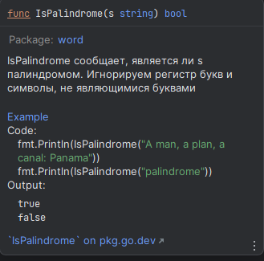

# 11.6. Функции-примеры

Третий вид функций, обрабатываемых командой `go test` специальным образом, — `функции-примеры`, имя которых начинается с
`Example`. Они не имеют ни параметров, ни результатов. Вот пример такой функции для `IsPalindrome`:

``` go
func ExampleIsPalindrome() {
	fmt.Println(IsPalindrome("A man, a plan, a canal: Panama"))
	fmt.Println(IsPalindrome("palindrome"))
	// Output:
	// true
	// false
}
```

Функции-примеры служат **трем целям**. Основная из них — `документация`: хороший пример может быть более сжатым или
интуитивно понятным средством передачи информации о поведении библиотечной функции, чем ее словесное описание, особенно
при использовании в качестве напоминания или краткой справки. Пример может также продемонстрировать взаимодействие между
несколькими типами и функциями, принадлежащими одному API, тогда как словесная документация всегда оказывается
привязанной к одному объекту, такому как тип, объявление функции или пакет в целом. И, в отличие от примеров в
комментариях, функции-примеры являются **реальным кодом Go, проверяемым во время компиляции**, так что они не становятся
устаревшими по мере развития рабочего кода.

Основываясь на суффиксе `Example`, сервер документации на базе веб `godoc` связывает функции-примеры с функцией или
пакетом, который они иллюстрируют, так что `ExamplelsPalindrome` будет отображаться в документации для
функции `IsPalindrome`, и в качестве функции с именем `Example` будет связан с пакетом `word` в целом.



Второе предназначение функций-примеров заключается в том, что **примеры являются выполнимыми тестами**, запускаемыми
командой `go test`. Если в функции-примере содержится завершающий комментарий `// Output:`, как показано выше,
тест-драйвер **выполнит эту функцию и проверит**, выводит ли она в стандартный поток вывода текст, указанный в
комментарии.

Третья цель примера — **практические эксперименты**. Сервер `godoc` по адресу `golang.org` использует `Go Playground`,
чтобы позволить пользователю редактировать и запускать каждую функцию-пример из веб-браузера. Часто это самый быстрый
способ “пощупать” определенную функцию или возможность языка.

В последних двух главах книги описаны пакеты reflect и unsafe, которые регулярно используют лишь несколько программистов
на Go (и еще меньшему количеству они реально нужны). Если вы пока еще не написали каких-либо особо существенных программ
на Go, сейчас самое время заняться этим.

## Выводы:

* `Функции-примеры` в Go называются `Example` и **не имеют параметров и результатов**; их основная роль - служить
  документацией для библиотечных функций и продемонстрировать взаимодействие между несколькими типами и функциями API;
* Примеры функций облегчают понимание работы функций, так как они являются реальным кодом Go, проверяемым во время
  компиляции, что обеспечивает их актуальность и предотвращает устаревание;
* Используя суффикс `Example`, веб-сервер документации `godoc` связывает функции-примеры с функцией или пакетом, который
  они иллюстрируют, облегчая поиск и понимание соответствующей информации;
* `Функции-примеры` являются выполнимыми тестами, запускаемыми командой `go test`, которая проверяет правильность вывода
  стандартного потока описанных в комментарии `// Output:`.