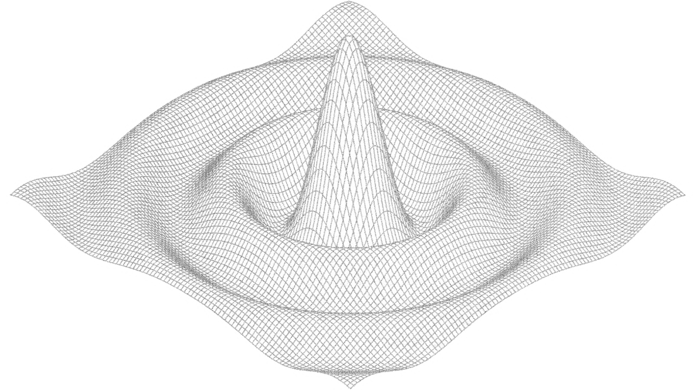
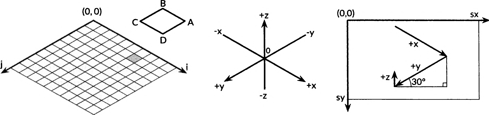

# 3.2 Числа с плавающей точкой

В Go есть 2 варианта числа с плавающей точкой - `float32` и `float64`.
Их арифметические свойства регулируются стандартом `IEEE 754` и реализованны на всех современных процессорах.

Значения этих числовых типов находятся в диапазоне от самых маленьких до огромных. Предельные значения с плавающей
точкой можно найти в пакете `math`. Константа `math.MaxFloat32`, наибольшее значение типа `float32`, примерно равна
`3.4e38`, а `math.MaxFloat64` - примерно `1.8e308`. Наименьшие положительные значения составляют около `1.4e45`
и `4.9e324` соответственно.

Тип `float32` обеспечивает приблизительно `6` десятичных цифр точности, тип `float64` - около `15` цифр.
Тип `float64` в большинстве случаев следует предпочитать типу `float32`, поскольку при использовании последнего, если не
принимать специальные меры, быстро накапливается ошибка, а наименьшее положительное целое число, которое не может быть
представлено типом `float32`, не очень велико:

``` go
var f float32 = 16777216 // 1 << 24 = 16777216
fmt.Println(f == f + 1) // true
```

Числа с плавающей точкой могут быть записаны буквально, с использованием десятичной записи:
`const e - 2.71828 // Приблизительно`

В записи могут быть опущены цифры перед десятичной точкой (`.707`) и после нее (`1.`). Очень малые и очень большие числа
лучше записывать с использованием научного формата, с буквой `e` или `E` перед десятичной степенью:

``` go
var Avogadro = 6.02214129e23
var Planck = 6.62606957e34
```

Значения с плавающей точкой удобно выводить с помощью символа преобразования `%g` функции `Printf`, которые выбирают
наиболее компактное представление значения с надлежащей точностью, но для таблиц данных могут оказаться предпочтительнее
символы преобразования `%e` (с показателем степени) или `%f` (без показателя степени). Все три варианта символов
преобразования позволяют указывать гирину поля и числовую точность:

``` go
for x := 0; x < 8: x ++ {
    fmt.Printf("x = %d e^x = %8.3f\n", x, math.Exp(float64(x))) 
}
```

Код выше выводит степени `e` с тремя десятичными цифрами точности, выровненными в поле длиной 8 символов:

``` go
x = 0 e^x = 1.000
x = 1 e^x = 2.718
x = 2 e^x = 7.389
x = 3 e^x = 20.086
x = 4 e^x = 54.598
x = 5 e^x = 148.413
x = 6 e^x = 403.429
x = 7 e^x = 1096.633
```

В дополнение к большой коллекции математических функций в пакете `math` имеются функции для создания и обнаружения
специальных значений, определенных стандартом `IEEE 754`: положительной и отрицательной бесконечности (которые
представляют числа чрезмерной величины и результат деления на нуль) и `NaN` (`not a number` - не число), являющееся
результатом таких математически сомнительных операций, как `0/0` или `Sqrt(-1)`:

``` go
var z float64
fmt.Printf(z, -z, 1/z, -1/z, z/z) // "0 -0 +Inf -Inf NaN"
```

Функция `math.IsNaN` проверяет, является ли ее значением `NaN`, а `math.NaN` возвращает это значение.
Может появиться соблазн использовать `NaN` в качестве значения-ограничителя в числовых вычислениях, но проверка, равен
ли
результат конкретных вычислений `NaN`, достаточно опасна, поскольку любое сравнение с `NaN` **_всегда_** дает
значение `false`:

``` go
nan := math.NaN()
fmt.Println(nan == nan, nan < nan, nan > nan) // "false false false"
```

Если функция, которая возвращает в качестве результата значение с плавающей точкой, может привести к ошибке или сбою, об
этом лучше сообщать отдельным возвращаемым значением, как показано ниже:

``` go
func compute() (value float64, ok bool) {
    //...
    if failed {
        return 0, false
    }
    return result, true
}
```

Приведенная далее программа иллюстрирует графические вычисления с плавающей точкой. Она строит график функции от двух
переменных `z = f(x, y)`, в виде трехмерной сетки с помощью `SVG` (`Scalable Vector Graphics` - масштабируемая векторная
графика), стандартного `XML-формата` для черчения линий.

На рисунке показан пример вывода программы для функции `sin(r)/r`, где `r` представляет собой `sqrt(x*x+y*y)`


См. surface.go
Функция `return` возвращает два значения, координаты угла ячейки.

Суть программы состоит в выполнении отображения между тремя различными системами координат, показаными на рисунке.


Первая - двумерная сетка размером 100х100 ячеек, идентифицируемых значениями целочисленных координат (i, j), начиная с (
0,0) в дальнем углу.
Мы выполняем черчение от дальнего конца к ближнему, так что дальние многоугольники могут быть скрыты находящимися ближе.

Вторая система координат представляет собой сетку трехмерных координат (x, y, z) с плавающей точкой, где x и y являются
линейными функциями от i и j, перемещенные так, что начало координат находится в центре, и масштабированные с помощью
константы xyrange. Высота z представляет собой значение функции поверхности f(x,y).

Третья система координат представляет собой канву двумерного изображения с точкой (0,0) в левом верхнем углу. Точки на
этой плоскости обозначается как (sx, sy). Мы используем изометрическую проекцию для отображения каждой трехмерной
точки (x, y, z) на двумерную канву. Чем дальше справа на канве находится точка, тем больше ее значение x или ее значение
y
или меньше ее значение z. Вертикальные и горизонтальные масштабные множители для x и y вычисляются как синус и косинус
угла 30°.
Масштабный множитель для z, равный 0.4, выбран произвольно.

Для каждой ячейки в двумерной сетке функция `main` вычисляет координаты на канве четырех углов многоугольника `ABCD`,
где вершина `B` соответствует (i, j), а вершины `A, C, D` являются ее соседями, а затем выводит SVG-команду его
черчения.

