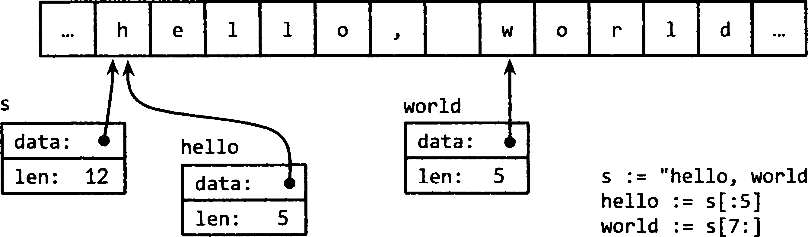

# 3.5 Строки

Строка представляет собой **_неизменяемую_** последовательность байтов. Могут содержать произвольные данные, в том числе
байты со значением `0`, но обычно они содержат удобочитаемый для человека текст.
Текстовые строки интерпретируются как последовательности символов `Unicode` в кодировке `UTF-8`.

Встроенная функция `len` возвращает количество байтов (**_не символов!_**) в строке, а операция **_индексирования_**
`s[i]` возвращает `i-й` байт строки `s`, где `0 <= i <= len(s)`:

``` go
s := "hello, world"
fmt.Println(len(s)) // "12"
fmt.Println(s[0], s[7])) // "104 119" ('h' and 'w')
```

Попытка обращения к байту вне этого диапазона приводит к панике (panic):

``` go
c := s[len(s)] // panic: индекс вне диапазона
```

`i-й` байт строки необязательно является `i-м символом` строки, поскольку кодировка `UTF-8` символов, не являющихся
символами `ASCII`, требует двух или более байтов.

Операция получения подстроки `s[i:j]` дает новую строку, состоящую из байтов исходной строки, начиная с индекса `i` и до
(но не включая) байта с индексом `j`. Результирующая строка содержит `j-i` байтов.

`fmt.Println(s[0:5] // "hello"`

При выходе индексов за пределы строки или если `j` меньше `i` возникает паника (panic).

Каждый из операндов `i` и `j` может быть опущен, и в этом случае используются значения по умолчанию - `0` (начало
строки) и `len(s)` (ее конец):

``` go
fmt.Println(s[:5]) // "hello"
fmt.Println(s[7:]) // "world"
fmt.Println(s[:]) // "hello world"
```

Оператор `+` создает новую строку путем конкатенации двух строк:

``` go
fmt.Println("goodbye" + s[5:]) // "goodbye, world"
```

Строки можно сравнивать с помощью операторов сравнения наподобие `==`, `<`. Сравнение выполняется байт за байтом,
поэтому оно происходит в естественном лексикографическом порядке.

Строковые значения являются неизменяемыми (имутабельные\immutable): последовательность байтов, содержащихся в строковом
значении, не может быть изменена, хотя, конечно же, можно присвоить строковой переменной новое значение. Например, для
добавления одной строки к другой можно написать:

``` go
s := "левая нога"
t := s
s += ", правая нога"
```

Этот код не изменяет строку, изначально хранившуюся в `s`, но приводит к тому, что в `s` теперь хранится новая строка,
образованная инструкцией `+=`. В то же время в `t` хранится старая строка.

``` go
fmt.Println(s) // "левая нога, правая нога"
fmt.Println(t) // "левая нога"
```

Так как строки - неизменяемые (immutable), конструкции, которые пытаются изменить данные строки не допускаются:

``` go
s[0] = 'L' // Ошибка компиляции: нельзя присваивать s[0]
```

Неизменяемость (immutable) означает, что две копии строки могут вполне безопасно разделять одну и ту же память, что
делает копирование строки любой длины очень дешевой операцией. Аналогично строка `s` и подстроки, такие как `s[7:]`,
могут безопасно разделять одни и те же данные, поэтому операция получения подстроки также очень дешевая. В обоих случаях
не выделяется никакая новая память. На рисунке показано расположение строки и двух ее подстрок, использующих один и тот
же массив байтов.


## Выводы:

* Строки в Go являются `неизменяемыми последовательностями байтов` и обычно содержат текстовые символы `Unicode`,
  закодированные в `UTF-8`;
* Для получения `длины строки в байтах` используется встроенная функция `len`, и нужно помнить, что она возвращает
  количество байтов, а не символов;
* Индексирование строк в Go происходит по байтам, а не по символам, и обращение к байту с помощью операции `s[i]`, где
  `0 <= i <= len(s)` позволяет получить `i-й` байт строки;
* Необходимо избегать индексации за пределами строки, так как это приведет к панике `(panic)`;
* Чтобы получить подстроку из строки можно использовать операцию среза `s[i:j]`, где `i` и `j` указывают на начальный и
  конечный `(не включительно)` индексы байтов;
* Конкатенация строк происходит с помощью оператора `+`, что позволяет склеивать строки, создавая новую строку;
* При конкатенации, создается новый объект строки в памяти, содержащий объединение исходных строк. Исходные строки
  остаются неизменными и удаляются из памяти только при выполнении сборки мусора. рекомендуется использовать другие
  методы работы со строками, которые не требуют создания новых объектов в памяти, например, метод `Join`;
* Сравнение строк возможно с использованием операторов `==`, `<`, что делает их удобными для работы в условиях и циклах;
* Из-за `неизменяемости` строк в Go, нельзя изменять значения их байтов напрямую, при этом копирование строк и получение
  подстрок требуют минимальных затрат по памяти, так как они могут разделять одни и те же данные;
* Например, при `копировании` строки в новую переменную, никакие `данные не копируются`, а лишь `создается новая ссылка`
  на уже существующий кусок памяти со строкой. Таким образом, копирование строк не вызывает дополнительных затрат по
  памяти. То же самое актуально для `получения подстроки`;
* Работа со строками в Go позволяет эффективно оперировать текстовыми данными, избегая частых выделений памяти и
  операций изменения строк.