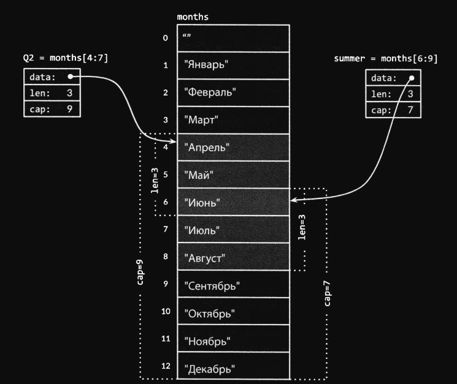

# 4.2 Срезы

Срезы представляют собой последовательности переменной длины, все элементы которых имеют один и тот же тип. Тип среза
описывается как `[]T`, где `T` - тип элементов среза. Он выглядит как тип массива без указания размера.

Массивы и срезы тесно связаны. Срез - это легковесная структура данных, которая предоставляет доступ к
подпоследовательности элементов массива (или, возможно, ко всем элементам), известного как **_базовый массив_**.
Срез состоит из трех компонентов:

* указателя
* длины
* емкости.

**Указатель - указывает на первый элемент массива**, доступный через срез (который необязательно совпадает с первым
элементом массива).

**Длина** - **это количество элементов среза**, она не может превышать **емкость**, которая, как правило, **представляет
собой количество элементов между началом среза и концом базового массива**. Эти значения возвращаются встроенными
функциями `len` и `cap`.

Несколько срезов могут совместно использовать один и тот же базовый массив и относиться к перекрывающимся частям этого
массива. На рисунке показан массив строк для месяцев года и два перекрывающихся среза. Массив объявляется как:

``` go
months := [...]string{1: "Январь", 2: "Февраль", /*...*/, 12: "Декабрь"}
```

Так что **январь** соответствует элементу `months[1]`, а декабрь - `months[12]`. Как обычно, первое значение находится в
элементе массива с индексом `0`, но, поскольку месяцы всегда нумеруются начиная с `1`, инициализацию нулевого элемента в
объявлении можно опустить, и он будет инициализирован пустой строкой.



Оператор среза `s[i:j]`, где `0 <= i <= j <= cap(s)`, создает новый срез, ссылающийся на элементы последовательности `s`
с `i` по `j-1`. Последовательность может быть переменной массива, указателем на массив или другим срезом. Получаемый в
результате срез имеет `j-1` элементов. Если значение `i` опущено, используется значение `0`. Если опущено значение `j`,
используется значение `len(s)`. Таким образом, срез `months[1:13]` содержит весь диапазон допустимых месяцев, как и срез
`months[1:]`.
Срез `months[:]` указывает на весь массив.

В примере ниже, определим перекрывающиеся срезы для второго квартала и для лета в северном полушарии:

``` go
Q2 := months[4:7]
summer := months[6:9]
fmt.Println(Q2) // ["Апрель", "Май", "Июнь"]
fmt.Println(summer) // ["Июнь", "Июль", "Август"]
```

Июнь включен в оба среза и является единственным выводом приведенного далее (**неэффективного**) поиска общих элементов:

``` go
for _, s := range summer {
    for _, q := range Q2 {
        if s == q {
            fmt.Printf("%s находится в обоих срезах\n", s)
        }
    }
}
```

"Срезание" за пределами `cap(s)` вызывает `panic` (аварийную ситуацию), а срезание за пределами `len(s)` приводит к
расширению среза, так что результат может быть длиннее оригинала:

``` go
fmt.Println(summer[:20]) // panic: выход за диапазон
endlessSummer := summer[:5] // Расширение среза (в пределах диапазона)
fmt.Println(endlessSummer) // "[Июнь, Июль, Август, Сентябрь, Октябрь]"
```

В качестве отступления, нужно отметить сходство операции получения подстроки при работе со строками и операции среза при
работе со срезами `[]byte`. Обе операции записываются как `x[m:n]` и обе они возвращают подпоследовательности исходных
байтов, используя базовое представление, так что обе операции выполняются за константное время. Выражение `x[m:n]` дает
строку, если `x` - это строка, и `[]byte`, если `x` - это объект `[]byte`.

Так как срез содержит указатель на элемент массива, передача среза в функцию позволяет изменять элементы базового
массива. Другими словами, копирование среза создает _**псевдоним**_ для базового массива. Приведенная функция `reverse`
(см. rev.go), обращает порядок элементов среза `[]int` на месте, без привлечения дополнительной памяти, и может быть
применена к
срезам любой длины

Вот так выглядит обращение порядка элементов массива `a`:

``` go
a := [...]int{0, 1, 2, 3, 4, 5}
reverse(a[:]) // см. rev.go
fmt.Println(a) // "[5 4 3 2 1 0]"
```

Чтобы выполнить **_циклический сдвиг_** среза влево на `n`-элементов, можно просто трижды применить функцию `reverse`:

* к первым `n` элементам
* к оставшимся элементам
* ко всему срезу

> Для **_циклического сдвига вправо_** первым выполняется третий вызов

``` go
s := []int{0, 1, 2, 3, 4, 5}
// Циклический сдвиг влево на две позиции
reverse(s[:2]) //  [1 0 2 3 4 5]
reverse(s[2:]) //  [1 0 5 4 3 2]
reverse(s)     //  [2 3 4 5 0 1]
fmt.Println(s) // "[2 3 4 5 0 1]"
```

**Выражение, которое инициализирует срез `s`, отличается от такового для массива `a`**.
**_Литерал среза_** выглядит как литерал массива, в виде последовательности значений, разделенных запятыми и заключенных
в фигурные скобки, но размер при этом не указан. Тем самым неявно создаются переменная **массива правильного размера**,
и **срез, который на него указывает**. Как и в случае _литералов массива_, _литералы срезов_ могут указывать значения
упорядоченно или явно указывать их индексы, или использовать сочетание этих двух стилей.

В отличие от массивов срезы не являются сравниваемыми, поэтому мы не можем использовать оператор `==`, чтобы проверить,
содержат ли два среза одинаковые элементы. Для сравнения двух срезов байтов `[]byte` стандартная библиотека
предоставляет высокооптимизированную функцию `bytes.Equal`, но для других типов срезов необходимо выполнять сравнение
самостоятельно:

``` go
func equal(x, y []string) bool {
    if len(x) != len(y) {
    return false
    }
    for i := range x {
        if x[i] != y[i] {
            return false
        }
    }
    return true
}
```

Глядя на естественность этой "глубокой" проверки равенства и на то, что стоимость ее выполнения не превышает таковую для
оператора `==` для массивов строк, может показаться странным, почему точно так же не выполняется и сравнение срезов.
На это есть 2 причины:

* Во-первых, в отличие от элементов массива элементы среза являются косвенными, что позволяет срезу содержать самого
  себя. Хотя, есть способы обработки таких ситуаций, ни один из них не является простым, эффективным и, что самое важное
  очевидным.
* Во-вторых, в силу косвенности элементов фиксированное значение среза может содержать различные элементы в разные
  моменты времени при изменении содержимого базового массива. Поскольку хеш-таблицы, такие, как тип `map` Go, делают
  только поверхностные копии своих ключей, требуется, чтобы равенство для каждого ключа оставалось неизменным на
  протяжении всего времени жизни хеш-таблицы. Таким образом, глубокая эквивалентность делает срезы неподходящими для
  использования в качестве ключей `map`. Для ссылочных типов, таких как указатели и каналы, операторы `==` проверяют
  **_ссылочную тождественность_** (равенство), т.е. ссылаются ли две сущности на один и тот же объект. Аналогично
  проверка "поверхностного" равенства для срезов может оказаться полезной и позволит решить проблему с `map`, но такая
  несогласованная трактовка срезов и массивов оператором `==` будет запутывать программистов. Поэтому самым безопасным
  решением является полный запрет сравнения срезов.

**_Единственным разрешенным сравнением среза является сравнение с `nil`:_**

``` go
if summer == nil { /*...*/ }
```

Нулевым значением типа среза является значение `nil`. Такой срез не имеет базового массива. И длина, и емкость нулевого
среза равны нулю, но нулевыми длинной и емкостью могут обладать и ненулевые срезы, такие как `[]int{}`
или `make([]int, 3)[3:]`. Как и в случае любого типа, который может иметь значение `nil`, это значение для конкретного
среза можно записать с помощью выражения преобразования, такого как `[]int(nil)`:

``` go
var s []int    // len(s) == 0, s == nil
s = nil        // len(s) == 0, s == nil
s = []int(nil) // len(s) == 0, s == nil
s = []int{}    // len(s) == 0, s == nil
```

Так что, если необходимо проверить, является ли срез пустым, нужно использовать проверку `len(s) == 0`, но
не `s == nil`. За исключением сравнения со значением `nil` нулевой срез ведет себя как любой другой пустой
срез `(len(s)==0)`.
Например, вызов `reverse(nil)` является совершенно безопасным. Если не задокументированно обратное, функции Go должны
рассматривать все срезы нулевой длины одинаково, независимо от того, равны они `nil` или нет.

Встроенная функция `make` создает неименованную переменную массива и возвращает его срез. Сам массив доступен только
через возвращаемый срез. В первом случае срез является представлением всего массива целиком. Во втором срез является
представления только первых `len` его элементов, но его емкость включает в себя весь массив. Дополнительные элементы
отводятся для будущего роста среза.


### Вывод
Когда мы создаем срез и инициализируем его определенным числом элементов, Go создает массив заданного размера, на
который ссылается этот срез. Мы можем изменять содержимое этого массива через срез, добавлять или удалять элементы из
среза. Однако, мы не можем добавлять больше элементов, чем емкость среза, которая устанавливается при создании среза.

Емкость среза может быть больше его длины, но не меньше. Если мы хотим добавить больше элементов в срез, чем его
емкость, то Go создаст новый массив большего размера и скопирует в него элементы из старого массива. При этом, ссылка на
новый массив будет сохранена в существующем срезе.

Например, если мы создаем срез в Go следующим образом:

``` go 
a := make([]int, 10)
```

Go создаст массив типа int с длиной 10 и вернет срез, который ссылается на этот массив. Мы можем изменять содержимое
этого массива через срез, добавлять или удалять элементы из среза. Однако, мы не можем добавлять больше 10 элементов в
этот срез, так как его емкость равна 10. Если мы попытаемся добавить больше элементов, чем емкость среза, то Go создаст
новый массив большего размера и скопирует в него элементы из старого массива.