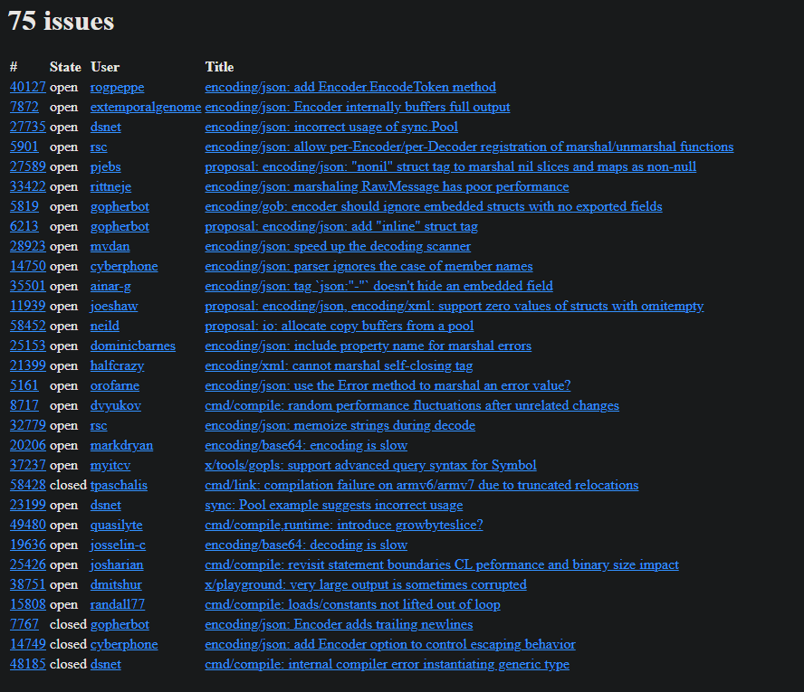
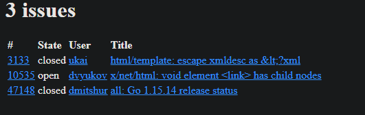
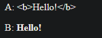

# 4.6 Текстовые и HTML-шаблоны

Разделить форматирование и код можно с помощью пакетов `text/template` и `html/template`. Они обеспечивают механизм для
подстановки значений переменных в текстовый или HTML-шаблон.

Шаблон - строка или файл, содержащая один или несколько фрагментов в двойных фигурных скобках `{{...}}`, именуемых
**_действиями (action)_**. Большая часть строки выводится буквально, но **_действия_** изменяют поведение программы по
умолчанию.
Каждое **_действие_** содержит выражение на языке шаблонов - простой, но мощной системы записи для вывода значений,
выбора полей структуры, вызова функций и методов, выражений управления потоком (`if-esle, range`) и создания других
шаблонов.

В файле `issuesreport.go` приведена простая шаблонная строка.

Этот шаблон сначала выводит количество соответствующих запросу тем, а затем номер, имя пользователя, название и возраст
в днях каждой из них. В **_действии_** имеется понятие текущего значения, которое записывается как точка `.`. Точка
изначально указывает на параметр шаблона, который в данном примере представляет собой `github.IssuesSearchResult`.

**Действие** `{{.TotalCount}}` раскрывается в значение поля `TotalCount`, выводимое обычным способом.
**Действия** `{{range.Items}}` и `{{end}}` создают цикл, так что подстановка последовательных элементов `Items` в текст
между этими действиями выполняется несколько раз. Точка при этом указывает на очередной элемент `Items`.

В **_действии_** запись `|` делает результат одной операции аргументом другой, аналогично конвейеру оболочки `Unix`. В
случае `Title` вторая операция представляет собой функцию `printf`, которая является встроенным синонимом
для `fmt.Sprintf` во всех шаблонах. Что касается `Age`, то вторая операция является функцией `daysAgo`, которая
преобразует поле `CreatedAt` в количество прошедших дней с использованием `time.Since`:

``` go
func daysAgo(t time.Time) int {
    return int(time.Since(t).Hours() / 24)
}
```

> Типом `CreatedAt` является `time.Time`, а не `string`

Так же, как тип может управлять его строковым форматированием, путем определения некоторых методов, тип может определять
методы для управления его `JSON-маршалингом` и `демаршалингом`. Маршалинг `JSON` значения `time.Time` дает строку в
стандартном формате.

Получение вывода с помощью шаблона осуществляется в два этапа. Сначала необходимо выполнить синтаксический анализ
шаблона в подходящее внутреннее представление, а затем выполнить его для конкретных входных данных. Анализ необходимо
выполнить только один раз. Приведенный ниже код создает определенный шаблон (см. `issuesreport.go`) `templ` и выполняет
его синтаксический анализ. **_Цепочка вызовов методов:_**

* `template.New` создает и возвращает шаблон
* `Funcs` добавляет к набору функций, доступных этому шаблону, функцию `daysAgo`, а затем возвращает этот шаблон
* К полученному результату применяется функция `Parse`

``` go

report, err := template.New("report").
    Funcs(template.FuncMap{"daysAgo": daysAgo}).
    Parse(templ)
if err != nil {
    log.Fatal(err)
}
```

Поскольку шаблоны обычно фиксированы во время компиляции, сбой синтаксического анализа шаблона указывает на фатальную
ошибку в программе.

Вспомогательная функция `template.Must` делает обработку ошибок более удобной: она принимает шаблон и ошибку, проверяет,
что ошибка является нулевой (в противном случае возникает паника (`panic`)).

После того как шаблон создан, оснащен функцией `daysAgo`, проанализирован и проверен, мы можем выполнить его с
использованием `github.IssuesSearchResult` в качестве источника данных и `os.Stdout` в качестве места назначения вывода:

``` go
var report = template.Must(template.New("report").
    Funcs(template.FuncMap{"daysAgo": daysago}).
    Parse(templ))
    
func main() {
    result, err := github.SearchIssues(os.Args[1:])
    if err != nil {
        log.Fatal(err)
    }
    
    if err := report.Execute(os.Stdout, result); err != nil {
        log.Fatal(err)
    }
}
```

Эта программы выводит обычный текстовый отчет наподобие следующего:

```
$ go build .\issuesreport.go
$ .\issuesreport repo:golang/go is:open json decoder
78 тем:
---------------------------------
Number: 56733
User: rolandshoemaker
Title: encoding/json: add (*Decoder).SetLimit
Age: 108 days
---------------------------------
Number: 48298
User: dsnet
Title: encoding/json: add Decoder.DisallowDuplicateFields
Age: 539 days
---------------------------------
...
```

Теперь обратимся к пакету `html/template`. Он использует такие же API и язык выражений, как и `text/template`, но
добавляет возможности для автоматического и соответствующего контексту экранирования некоторых символов управляющими
последовательностями в строках, которые появляются в HTML, JavaScript, CSS или URL. Эти возможности позволяют избежать
давней проблемы генерации HTML - **_атаки с помощью инъекций_** - злоумышленник передает строковое значение,
наподобие заголовка, содержащее вредоносный код, которое, будучи некорректно преобразовано в шаблоне, предоставляет
ему контроль над страницей.

Приведенный шаблон (см. `issueshtml.go`) выводит список тем в виде таблицы HTML (результат на рис.).



Ни одна из тем на рисунке не представляет собой сложностей для HTML, но проблема есть. Ее будет видно, если рассмотреть
темы, названия которых содержат метасимволы HTML, такие как `&` и `<`. Для нашего примера есть 2 такие темы с номерами:
`$ ./issueshtml repo:golang/go 3133 10535 > issues2.html`

На рисунке показан результат этого запроса.



Пакет `html/template` автоматически преобразует названия тем в HTML так, что они появляются в буквальном виде. Если бы
мы по ошибке использовали пакет `text/template`, то четырехсимвольная строка `&lt;` была бы выведена как символ `<`, а
строка `<link>` превратилась бы в элемент `link`, изменив структуру HTML-документа и, возможно, сделав его небезопасным.

Такое автоматическое экранирование для полей, содержащих данные HTML, можно подавить с помощью именованного строкового
типа `template.HTML`, а не `string`. Аналогичные имена типов имеются для JavaScript, CSS и URL. В программе `autoescape`
демонстрируется использование двух полей с одним и тем же значением, но разными типами: `A` имеет тип `string`, а `B` -
`template.HTML`

На рисунке показано, какой вид имеет вывод шаблона в браузере. В строке `A` метасимволы заменены соответствующими
управляющими последовательностями для их корректного вывода, а в строке `B` - нет.



