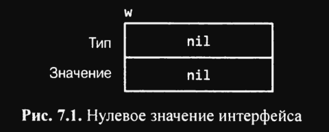
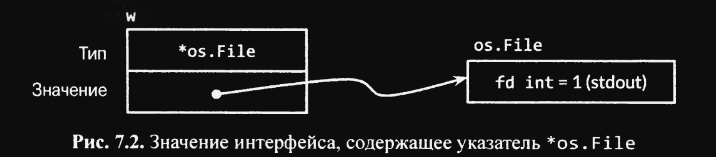
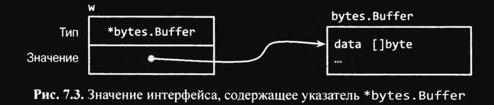
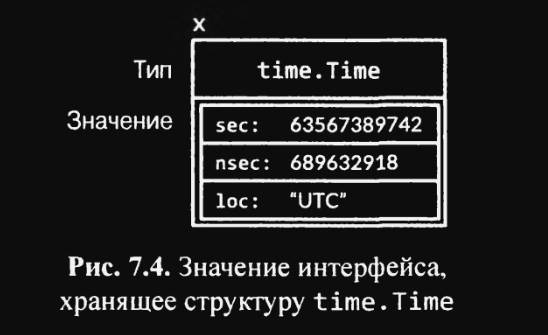

# 7.5 Значения интерфейсов

Концептуально значение интерфейсного типа, или просто `значение интерфейса`, имеет два компонента - конкретный тип и
значение этого типа. Они называются `динамическим типом` и `динамическим значением` интерфейса.

Для статически типизированного языка, такого как Go, типы являются понятием времени компиляции, поэтому тип не является
значением. В нашей концептуальной модели множество значений, именуемых `дескрипторами типов`, предоставляет сведения о
каждом типе, такие как его имя и методы. В значении интерфейса компонент типа представлен соответствующим дескриптором
типа.

В языке Go `дескриптор типа (type descriptor)` - это набор метаданных, которые описывают тип. Он включает в себя
информацию, такую как имя типа, его размер, поля, методы и другие свойства типа.

`Дескриптор типа` является статической информацией, которая доступна во время компиляции и используется компилятором для
проверки типов и генерации машинного кода.

`Дескриптор типа` может быть получен во время выполнения программы с помощью функции `reflect.TypeOf()`, которая
возвращает
объект `reflect.Type`, содержащий информацию о типе. Это позволяет программам выполнять ряд динамических операций с
типами, таких как создание новых экземпляров типа или вызов его методов во время выполнения.

Дескриптор типа также используется в значении интерфейса для хранения информации о типе значения, который хранится в
интерфейсе.

В инструкциях ниже переменная `w` принимает три разные значения. (Начальное и конечное значения переменной одинаковы.)

``` go
var w io.Writer
w = os.Stdout
w = new(bytes.Buffer)
w = nil
```

Давайте взглянем на значение и динамическое поведение `w` после каждой инструкции. Первая инструкция объявляет `w`:

``` go
var w io.Writer
```

Переменные в Go всегда инициализируются точно определенным значением, и интерфейсы не являются исключением. Нулевое
значение для интерфейса имеет и тип, и значение, равные `nil` (см. рис. 7.1)


Значение интерфейса описывается как нулевое или ненулевое на основе его динамического типа, так что здесь мы видим
нулевое значение интерфейса. Проверить, является ли значение интерфейса нулевым, можно с помощью инструкций `w==nil` или
`w!=nil`. Вызов любого метода нулевого интерфейса приводит к панике:

``` go
w.Write([]byte("hello")) // panic: разыменовывание нулевого указателя
```

Вторая инструкция присваивает переменной `w` значение типа `*os.File`:

``` go
w = os.Stdout
```

Это присваивание включает неявное преобразование из конкретного типа в тип интерфейса, эквивалентное явному
преобразованию `io.Writer(os.Stdout)`. Преобразование этого рода, явное или неявное, охватывает тип и значение своего
операнда. Динамический тип значения интерфейса устанавливается равным дескриптору для типа указателя `*os.File`, а его
динамическое значение хранит копию `os.Stdout`, которая является указателем на переменную `os.File`, представляющую
стандартный вывод процесса (рис. 7.2)


Вызов метода `Write` значения интерфейса, содержащего указатель `*os.File` приводит к вызову метода `(*os.File).Write`.
Этот вызов выводит строку "hello".

``` go
w.Write([]byte("helo)) // hello
```

В общем случае, во время компиляции мы не можем знать, каким будет динамический тип значения интерфейса, поэтому вызов
с помощью интерфейса должен использовать `динамическую диспетчеризацию`. Вместо непосредственного вызова компилятор
должен генерировать код для получения адреса метода с именем `Write` из дескриптора типа и выполнить косвенный вызов по
этому адресу. Аргументом получателя для вызова является копия динамического значения интерфейса `os.Stdout`.
Мы получаем такой же результат, как если бы мы выполнили этот вызов непосредственно:

``` go
os.Stdout.Write([]byte("hello")) // hello
```

`Динамическая диспетчеризация` - это механизм в языках программирования, который позволяет выбирать правильную
реализацию метода на основе `динамического типа объекта` во время выполнения программы, а не на этапе компиляции.

Другими словами, если у нас есть интерфейс с методами, и мы присваиваем ему значение конкретного типа, то при вызове
метода этого интерфейса, программа будет использовать реализацию метода соответствующего типа.

Это позволяет создавать более гибкие и расширяемые программы, так как мы можем передавать различные объекты, реализующие
один и тот же интерфейс, и программный код будет работать правильно с любым из них, не зависимо от их конкретного типа.

Третья инструкция присваивает значение типа `*bytes.Buffer` значению интерфейса:

``` go
w = new(bytes.Buffer)
```

Теперь динамический тип представляет собой `*bytes.Buffer`, а динамическое значение представляет собой указатель на
вновь выделенный буфер (Рис. 7.3)


Вызов метода `Write` использует тот же механизм, который был описан ранее:

``` go
w.Write([]byte("hello")) // Выводит "hello" в bytes.Buffer
```

На этот раз дескриптором типа является `*bytes.Buffer`, так что вызывается метод `(*bytes.Buffer).Write` с адресом
буфера в качестве значения параметра получателя. Вызов добавляет в буфер строку "hello".

Наконец, четвертая инструкция присваивает `nil` значению интерфейса:

``` go
w = nil
```

Эта инструкция сбрасывает оба компонента в нуль, восстанавливая то же состояние `w`, которое было при ее объявлении (см.
на рис 7.1)

Значение интерфейса может хранить динамические значения произвольного размера. Например, тип `time.Time`, представляющий
момент времени, является структурным типом с несколькими неэкспортируемыми полями. Если мы создадим из него значение
интерфейса

``` go
var x interface{} = time.Now()
```

то результат может выглядеть так, как показано на рис. 7.4.

Концептуально динамическое значение всегда размещается внутри значения интерфейса, независимо от того, насколько велик
размер его типа. (Это только концептуальная модель; реальная реализация несколько иная.)

Значения интерфейсов можно сравнивать с использованием операторов `==` и `!=`. Два значения интерфейсов равны, если оба
равны `nil` или если их динамические типы одинаковы, а динамические значения равны согласно результату сравнения с
помощью оператора `==` с обычным поведением для данного типа. Поскольку значения интерфейсов сравнимы, они могут
использоваться в качестве ключей карт или операндов инструкции `switch`.

Однако если сравниваются два значения интерфейсов, имеющих одинаковые динамические типы и эти типы не сравнимы
(например, срезы), то сравнение заканчивается паникой:

``` go
var x interface{} = []int{1, 2, 3}
fmt.Println(x==x) // panic: несравниваемые типы []int
```

В этом отношении типы интерфейсов необычны. Другие типы безопасно сравниваемы (такие, как фундаментальные типы или
указатели) или не сравниваемы вообще (срезы, карты, функции), но при сравнении значений интерфейсов или составных типов,
содержащих значения интерфейсов, мы должны учитывать потенциальную возможность возникновения паники. Аналогичный риск
существует при использовании интерфейсов в качестве ключей карт или операндов `switch`. Значения интерфейсов можно
сравнивать только в том случае, если мы уверены, что они содержат динамические значения сравниваемых типов.

При обработке ошибок или при отладке часто оказывается полезной информация о динамическом типе значения интерфейса. Для
этого можно использовать символы преобразования `%T` пакета `fmt`:

``` go
var w io.Writer
fmt.Printf("%T\n", w) // <nil>

w = os.Stdout
fmt.Printf("%T\n", w) // <*os.File>

w = new(bytes.Buffer)
fmt.Printf("%T\n", w) // <*bytes.Buffer>
```

Для получения имени динамического типа интерфейса пакет `fmt` использует рефлексию. Мы познакомимся с ней в главе 12.

## Выводы:

* `Интерфейс` в Go состоит из двух компонентов - `динамического типа` и `динамического значения`, которые представляют
  `конкретный тип` и `его значение` соответственно;
* Для Go, как для статически типизированного языка, типы являются понятием времени компиляции, поэтому тип не является
  значением;
* `Дескрипторы типов` предоставляют информацию о каждом типе, такую как его имя и методы;
* В `значении интерфейса` компонент типа представлен дескриптором соответствующего типа;
* Переменные в Go всегда инициализируются точным значением, интерфейсы не являются исключением;
* Нулевое значение для интерфейса имеет и тип, и значение, равные `nil`;
* Значение интерфейса можно описать как нулевое или ненулевое, в зависимости от его динамического типа;
* Для проверки, является ли значение интерфейса нулевым, можно использовать инструкции `w==nil` и `w!=nil`;
* Вызов любого метода нулевого интерфейса приводит к
  панике `w.Write([]byte("hello")) // panic: разыменовывание нулевого указателя`;
* `w = os.Stdout` - эта инструкция присваивает `w` значение типа `*os.File` и включает неявное преобразование из
  конкретного типа в тип интерфейса, которое эквивалентно явному преобразованию `io.Writer(os.Stdout)`. Такие
  преобразования охватывают тип и значение своего операнда. Динамический тип значения интерфейса устанавливается равным
  дескриптору для типа указателя `*os.File`, а его динамическое значение хранит **копию** `os.Stdout`, которая является
  указателем на переменную `os.File`, представляющую стандартный вывод процесса;
* Во время компиляции мы не можем знать, каким будет динамический тип значения интерфейса, поэтому вызов
  с помощью интерфейса должен использовать `динамическую диспетчеризацию`;
* Вместо непосредственного вызова компилятор должен генерировать код для получения адреса метода с именем `Write` из
  дескриптора типа и выполнить косвенный вызов по этому адресу. Аргументом получателя для вызова является копия
  динамического значения интерфейса `os.Stdout`. Когда мы используем интерфейсы в Go, то мы можем вызвать методы,
  которые не определены в интерфейсе, но определены в типе, который реализует этот интерфейс. Вместо того чтобы прямо
  вызывать метод, компилятор создает код для получения адреса этого метода из типа и вызывает его через адрес;
* `w = new(bytes.Buffer)` - присваивает значение типа `bytes.Buffer` значению интерфейса. Теперь `динамический тип`
  представляет собой `*bytes.Buffer`, а динамическое значение представляет собой указатель на вновь выделенный буфер;
* Значения интерфейсов в Go могут хранить динамические значения любого размера, что позволяет нам создавать обобщенные
  функции и методы;
* Значения интерфейсов можно сравнивать с использованием операторов `==` и `!=`. Два значения интерфейсов равны, если
  оба равны `nil` или если их динамические типы одинаковы, а динамические значения равны согласно результату сравнения с
  помощью оператора `==` с обычным поведением для данного типа;
* Поскольку значения интерфейсов сравнимы, они могут использоваться в качестве ключей карт или операндов
  инструкции `switch`. Но, если сравниваются два значения интерфейсов, имеющих одинаковые динамические типы и эти типы
  не сравнимы (например, срезы), то сравнение заканчивается паникой;
* В этом отношении типы интерфейсов в Go отличаются от других типов. Другие типы безопасно сравниваемы (такие, как
  фундаментальные типы или указатели) или не сравниваемы вообще (срезы, карты, функции), но при сравнении значений
  интерфейсов или составных типов, содержащих значения интерфейсов, мы должны учитывать потенциальную возможность
  возникновения паники;
* Значения интерфейсов можно сравнивать только в том случае, если мы уверены, что они содержат динамические значения
  сравниваемых типов;
* Аналогичный риск существует при использовании интерфейсов в качестве ключей карт или операндов `switch`. Значения
  интерфейсов можно сравнивать только в том случае, если мы уверены, что они содержат динамические значения сравниваемых
  типов;
* При обработке ошибок или при отладке часто оказывается полезной информация о динамическом типе значения интерфейса.
  Для этого можно использовать символы преобразования `%T` пакета `fmt`.