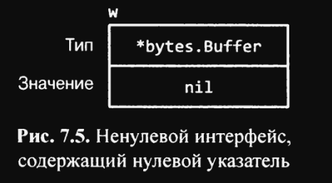

# 7.5.1 Осторожно: интерфейс, содержащий нулевой указатель, не является нулевым

Нулевое значение интерфейса, которое не содержит значения как такового, не совпадает со значением интерфейса, содержащим
нулевой указатель. Это тонкое различие создает ловушки, в которые попадал каждый программист на Go.

Рассмотрим приведенную ниже программу. Если значение `debug` равно `true`, функция `main` накапливает вывод функции `f`
в `bytes.Buffer`:

``` go
const debug = true

func main() {
    var buf *bytes.Buffer
    if debug {
        buf = new(bytes.Buffer) // Накопление ввода
    }
    f(buf) // Внимание: тонкая ошибка!
    if debug {
        // ... используем buf ...
    }
}

// Если out ненулевой, вывод записывается в него
func f(out io.Writer) {
    //... некоторые действия ...
    if out != nil {
        out.Write([]byte("done!\n"))
    }
}
```

Можно ожидать, что при изменении значения `debug` на `false` накопление вывода будет отключено, но на самом деле такое
изменение приводит к панике во время вызова `out.Write`:

``` go
if out != nil {
    out.Write([]byte("done!\n")) // panic: разыменование нулевого указателя
}
```

Когда функция `main` вызывает `f`, выполняется присваивание нулевого указателя типа `*bytes.Buffer` параметру `out`, так
что динамическое значение `out` равно `nil`.

Однако его динамическим типом является `*bytes.Buffer`, а это означает, что `out` представляет собой ненулевой
интерфейс, содержащий нулевое значение указателя (рис. 7.5), так что защитная проверка `out != nil` оказывается
пройденной.



Как и раннее, механизм динамической диспетчеризации определяет, что должен быть вызван `(*bytes.Buffer).Write`, но на
этот раз со значением получателя, равным `nil`. Для некоторых типов, таких как `*os.File`, `nil` является допустимым
получателем (раздел 6.2.1), но `*bytes.Buffer` среди них нет. Этот метод вызывается, но при попытке получить доступ к
буферу возникает паника.

Проблема заключается в том, что хотя нулевой указатель `*bytes.Buffer` имеет методы, необходимые для удовлетворения
интерфейсу, он не соответствует `поведенческим` требованиям интерфейса. В частности, вызов нарушает неявное предусловие
`(*bytes.Buffer).Write` о том, что получатель не является нулевым, так что присваивание нулевого указателя интерфейсу
ошибочное. Решение заключается в том, чтобы изменить тип `buf` в функции `main` на `io.Writer`, избегая, таким образом,
присваивания дисфункционального значения интерфейсу:

``` go
var buf io.Writer
if debug {
  buf = new(bytes.Buffer) // Накопление вывода
}
f(buf) // OK
```

Теперь, когда мы рассмотрели механику значений интерфейсов, давайте взглянем на некоторые более важные интерфейсы из
стандартной библиотеки Go. В следующих трех разделах мы увидим, как интерфейсы используются для сортировки, веб-служб и
обработки ошибок.

## Выводы:

* Нулевое значение интерфейса, которое не содержит значения как такового, не совпадает со значением интерфейса,
  содержащим нулевой указатель;
* Если значение `debug` равно `true`, функция `main` накапливает вывод функции `f` в `bytes.Buffer`, и при изменении
  значения `debug` на `false` накопление вывода отключается, что приводит к панике во время вызова `out.Write`;
* Динамическое значение `out` равно `nil`, но динамический тип `out` является `*bytes.Buffer`, что пройдет защитную
  проверку
  `out != nil`, но вызов `(*bytes.Buffer).Write` со значением получателя, равным `nil`, приводит к панике;
* Изменение типа `buf` в функции `main` на `io.Writer` избегает присваивания дисфункционального значения интерфейсу и
  решает проблему с некорректным вызовом `out.Write`.