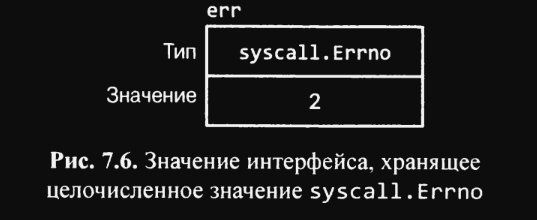

# 7.8 Интерфейс error

С самого начала этой книги мы использовали значения таинственного предопределенного типа `error`, не поясняя, что это
такое. На самом деле это просто тип интерфейса с единственным методом, который возвращает сообщение об ошибке:

``` go
type error interface {
	Error() string
}
```

Простейший способ создания `error` - использовать вызов `errors.New`, который возвращает новое значение `error` для
данного сообщения об ошибке. Весь пакет `errors` состоит только из четырех строк:

``` go
package error

func New(text string) error { return &errorString{text} }

type errorString struct {
	text string
}

func (e *errorString) Error() string { return e.text}
```

Базовый тип `errorString` является структурой, а не строкой, чтобы защитить его представление от случайного (или)
умышленного обновления. Причина, по которой тип указателя `*errorString`, а не сам тип `errorString`, соответствует
интерфейсу `error`, заключается в том, что каждый вызов `New` должен создавать экземпляр `error`, не равный никаким
другим. Было бы не слишком удобно, если бы, например, ошибка `io.EOF` оказывалась при сравнении равной ошибке, случайно
имеющей то же сообщение:

``` go
fmt.Println(errors.New("EOF") == errors.New("EOF")) // false
```

Вызов `errors.New` сравнительно редки, поскольку имеется удобная функция-оболочка, `fmt.Errorf`, которая заодно
выполняет форматирование строки. Мы использовали ее несколько раз в главе 5 (Функции):

``` go
package fmt

func Errorf(format string), args ...interface{}) error {
	return errors.New(Sprintf(format, args...))
}

```

Хотя `*errorString` может быть простейшим типом `error`, он далеко не единственный. Например, пакет `syscall`
предоставляет API низкоуровневых системных вызовов Go. На многих платформах он определяет числовой тип `Errno`,
соответствующий интерфейсу `error`, а на платформе `Unix` метод `Error` типа `Errno` выполняет поиск в таблице строк,
как показано ниже:

``` go
package syscall

type Errno uintptr // код ошибки ОС

var errors = [...]string{
	1: "операция не разрешена"         // EPERM
	2: "нет такого файла или каталога" // ENOENT
	3: "нет такого процесса"           // ESRCH
	//...
}

func (e Errno) Error() string {
	if 0 < int(e) && int(e) < len(errors) {
		return errors[e]
	}
	return fmt.Sprintf("errno %d", e)
}   
```

Приведенная далее инструкция создает значение-интерфейс, хранящее значение `Errno`, равное 2 и означающее
условие `ENOENT POSIX`:

``` go
var err error = syscall.Errno(2)
fmt.Println(err.Error()) // нет такого файла или каталога
fmt.Println(err)         // нет такого файла или каталога
```

Графически значение `err` показано на рис. 7.6


`Errno` является эффективным представлением ошибок системных вызовов, выбираемых из конечного множества, соответствующим
стандартному интерфейсу `error`. Другие типы, соответствующие этому интерфейсу, мы увидим в разделе 7.11

## Выводы:

* `error` - это тип интерфейса в Go, который используется для представления ошибок. Он имеет один метод `Error`, который
  возвращает сообщение об ошибке.
* Чтобы создать новое значение `error`, можно использовать функцию `errors.New(msg)`, которая принимает сообщение об
  ошибке и возвращает новое значение `error`;
* Внутри пакета `errors` есть тип `errorString`, который является структурой и используется для хранения сообщения об
  ошибке. Он не может быть изменен после создания (`инкапсуляция`);
* Каждый вызов `errors.New` создает новый экземпляр `error`, который не равен никакому другому. Это означает, что две
  ошибки с одинаковым сообщением об ошибке будут разными значениями `error`;
* Есть также функция `fmt.Errorf`, которая позволяет форматировать сообщение об ошибке и возвращает новое
  значение `error`. Она часто используется вместо `errors.New`
* Пакет `syscall` также предоставляет типы ошибок, которые соответствуют интерфейсу `error`. Они используются для
  представления ошибок системных вызовов. Он предоставляет `API` низкоуровневых системных вызовов Go.
  На многих платформах он предоставляет числовой тип `Errno`.