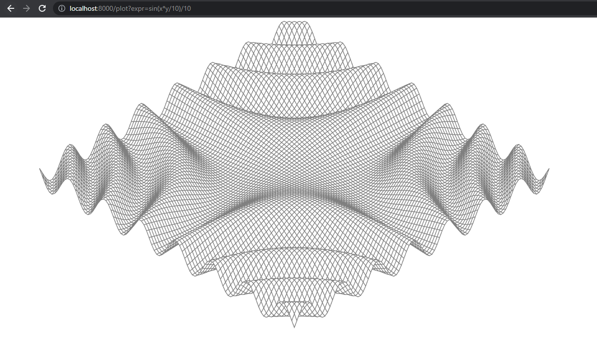

# 7.9 Пример: вычислитель выражения

В этом разделе будет создан вычислитель простых арифметических выражений. Мы используем интерфейс `Expr` для
представления любого выражения на этом языке. Пока что в нем нет методов, но мы добавим их позже:

``` go
// Expr представляет арифметическое выражение
type Expr interface{}
```

Наш язык выражений состоит из литералов с плавающей точкой; бинарных операторов `+, -, * и /`; унарных
операторов `-х и +х`; вызовов функций `pow(x, y)`, `sin(x)` и `sqrt(x)`; переменных, таких как `х` и` pi`; и, конечно
же, `скобок и правил стандартных приоритетов операторов`. Все значения имеют тип `float64`. Вот несколько примеров
выражений:

``` go
sqrt(A / pi)
pow(x, 3) + pow(y, 3)
(F - 32) * 5 / 9
```

Пять приведенных ниже конкретных типов представляют отдельные разновидности выражений (см. eval.go):

* `Var` представляет ссылку на переменную (мы вскоре поймем, почему она экспортируемая);
* `literal` представляет константу с плавающей точкой;
* Типы `unary` и `binary` представляют выражения с операторами с одним или двумя операндами, которые в свою очередь,
  могут быть любыми разновидностями `Expr`;
* `call` представляет вызов функции, мы ограничим ее поле `fn` значениями `pow`, `sin`, `sqrt`.

``` go
// Var определяет переменную, например x.
type Var string

// Представляет собой числовую константу, например 3.141.
type literal float64

// Представляет выражение с унарным оператором, например -x.
type unary struct {
	op rune // + или -
	x  Expr
}

// Представляет выражение с бинарным оператором, например x+y.
type binary struct {
	op   rune // +, -, *, /
	x, y Expr
}

// Представляет выражение вызова функции, например sin(x).
type call struct {
	fn   string // одно из pow, sin, sqrt
	args []Expr
} 
```

Чтобы вычислить выражение, содержащее переменные, нам понадобится `среда`, которая сопоставляет имена переменных со
значениями:

``` go
// Env сопоставляет имена переменных со значениями
type Env map[Var]float64
```

Нам также нужно, чтобы каждый вид выражения определял метод `Eval`, который возвращает значение выражения в
данной `среде`. Поскольку каждое выражение должно предоставлять этот метод, мы добавим его к интерфейсу `Expr`. Пакет
экспортирует только типы `Expr`, `Env`, `Var`; клиенты могут использовать вычислитель без обращения к другим типам
выражений.

``` go
type Expr interface {
  // Eval возвращает значение данного Expr в среде env.
  Eval(env Env) float64
}
```

Ниже приводятся конкретные методы `Eval`. Метод для `Var` выполняет поиск в среде, который возвращает нуль, если
переменная не определена, а метод для `literal` просто возвращает значение литерала.

``` go
// Eval выполняет поиск в среде, который возвращает нуль, если переменная не определена.
func (v Var) Eval(env Env) float64 {
	return env[v]
}
// Eval возвращает значение литерала
func (l literal) Eval(_ Env) float64 {
	return float64(l)
}
```

Методы для `unary` и `binary` рекурсивно вычисляют их операнды, а затем применяют к ним операцию `op`. Мы не
рассматриваем деление на нуль или бесконечность как ошибки, так как они дают результат, хотя и не являющийся конечным.
Наконец для `call` метод вычисляет аргументы функций `pow`, `sin`, `sqrt`, а затем вызывает соответствующую функцию из
пакета `math`.

``` go
// Eval рекурсивно вычисляет операнды и применяют к ним операцию op
func (u unary) Eval(env Env) float64 {
	switch u.op {
	case '+':
		return +u.x.Eval(env)
	case '-':
		return -u.x.Eval(env)
	}
	panic(fmt.Sprintf("неподдерживаемый унарный оператор: %q", u.op))
}

// Eval рекурсивно вычисляет операнды и применяют к ним операцию op
func (b binary) Eval(env Env) float64 {
	switch b.op {
	case '+':
		return b.y.Eval(env) + b.y.Eval(env)
	case '-':
		return b.y.Eval(env) - b.y.Eval(env)
	case '*':
		return b.x.Eval(env) * b.y.Eval(env)
	case '/':
		return b.x.Eval(env) / b.y.Eval(env)
	}
	panic(fmt.Sprintf("неподдерживаемый бинарный оператор: %q", b.op))
}

// Eval вычисляет аргументы функции pow, sin, sqrt и вызывает соответствующую функцию из пакета math
func (c call) Eval(env Env) float64 {
	switch c.fn {
	case "pow":
		return math.Pow(c.args[0].Eval(env), c.args[1].Eval(env))
	case "sin":
		return math.Sin(c.args[0].Eval(env))
	case "sqrt":
		return math.Sqrt(c.args[0].Eval(env))
	}
	panic(fmt.Sprintf("неподдерживаемый вызов функции: %s", c.fn))
}
```

Некоторые из этих методов могут завершаться ошибкой. Например, выражение `call` может содержать неизвестную функцию или
неверное количество аргументов. Можно также создать `unary` или `binary` с недопустимым оператором, таким как `!`
или `<` (хотя упомянутая ниже функция `Parse` никогда не поступит таким образом). Эти ошибки приводят к панике в `Eval`.
Другие ошибки, такие как вычисление `Var`, отсутствующей в среде, просто заставляют `Eval` вернуть неверный результат.
Все эти ошибки могут быть обнаружены путем проверки `Expr` перед его вычислением В этом и состоит работа метода `Check`,
который мы вскоре увидим, но сначала давайте проверим `Eval`.

Приведенная ниже функция `TestEval` представляет собой проверку вычислителя. Она использует пакет `testing`, который мы
будем рассматривать в главе 11, но пока достаточно знать, что вызов `t.Errorf` сообщает об ошибке. Функция проходит по
таблице входных данных, которая определяет три выражения и различные среды для каждого из них. Первое выражение
вычисляет радиус круга по площади `A`, второе вычисляет сумму кубов двух переменных, `x` и `y`, а третье преобразует
температуру по Фаренгейту `F` в температуру по Цельсию.

``` go
func TestEval(t *testing.T) {
	tests := []struct {
		expr string
		env  Env
		want string
	}{
		{"sqrt(A / pi)", Env{"A": 87616, "pi": math.Pi}, "167"},
		{"pow(x, 3) + pow(y, 3)", Env{"x": 12, "y": 1}, "1729"},
		{"pow(x, 3) + pow(y, 3)", Env{"x": 9, "y": 10}, "1729"},
		{"5 / 9 * (F - 32)", Env{"F": -40}, "-40"},
		{"5 / 9 * (F - 32)", Env{"F": 32}, "0"},
		{"5 / 9 * (F - 32)", Env{"F": 212}, "100"},
	}
	var prevExpr string
	for _, test := range tests {
		// Print expr only when it changes.
		if test.expr != prevExpr {
			fmt.Printf("\n%s\n", test.expr)
			prevExpr = test.expr
		}
		expr, err := Parse(test.expr)
		if err != nil {
			t.Error(err) // parse error
			continue
		}
		got := fmt.Sprintf("%.6g", expr.Eval(test.env))
		fmt.Printf("\t%v => %s\n", test.env, got)
		if got != test.want {
			t.Errorf("%s.Eval() in %v = %q, want %q\n",
				test.expr, test.env, got, test.want)
		}
	}
}
```

Для каждой записи в таблице тест выполняет синтаксический анализ выражения, вычисляет его в определенной среде и выводит
результат. У нас нет возможности привести здесь функцию `Parse`, но ее код можно найти, если загрузить пакет с
помощью `go install`.

Команда `go test` раздел 11.1 запускает тесты пакета:

``` shell
go test -v GolangBook/chapter7/lesson9/eval
```

Флаг `-v` позволяет увидеть вывод теста, который обычно подавляется для успешно пройденных тестов. Вот вывод инструкций
`fmt.Printf` теста:

``` shell
sqrt(A / pi)
        map[A:87616 pi:3.141592653589793] => 167

pow(x, 3) + pow(y, 3)
        map[x:12 y:1] => 1729
        map[x:9 y:10] => 1729

5 / 9 * (F - 32)
        map[F:-40] => -40
        map[F:32] => 0
        map[F:212] => 100
```

К счастью, пока что все входные данные корректно сформированы, но вряд ли так будет всегда. Даже в интерпретируемых
языках распространена проверка синтаксиса на `статические ошибки`, т.е. на ошибки, которые можно обнаружить без запуска
программы. Отделяя статические проверки от динамических, можно быстрее обнаруживать ошибки и выполнять много проверок
только один раз, вместо того, чтобы выполнять проверки при каждом вычислении выражения.

Давайте добавим в интерфейс `Expr` еще один метод. Метод `Check` выполняет проверку на статические ошибки в
синтаксическом дереве выражения. Его параметр `vars` мы поясним чуть позже.

``` go
// Expr представляет арифметическое выражение
type Expr interface {
	// Eval возвращает значение данного Expr в среде env.
	Eval(env Env) float64
	// Check сообщает об ошибках в данном Expr и добавляет свои Vars.
	Check(vars map[Var]bool) error
}
```

Ниже показаны конкретные методы `Check`. Вычисление `literal` и `Var` не может быть неудачным, поэтому методы `Check`
для этих типов возвращают `nil`. Методы для `unary` и `binary` сначала проверяют, что оператор является допустимым, а
затем рекурсивно проверяют операнды. Аналогично метод для `call` сначала проверяет, что функция известна и имеет
правильное количество аргументов, а затем рекурсивно проверяет каждый аргумент.

``` go
func (v Var) Check(vars map[Var]bool) error {
	vars[v] = true
	return nil
}

func (literal) Check(vars map[Var]bool) error {
	return nil
}

func (u unary) Check(vars map[Var]bool) error {
	if !strings.ContainsRune("+-", u.op) {
		return fmt.Errorf("неподдерживаемый унарный оператор: %q", u.op)
	}
	return u.x.Check(vars)
}

func (b binary) Check(vars map[Var]bool) error {
	if !strings.ContainsRune("+-*/", b.op) {
		return fmt.Errorf("неподдерживаемый бинарный оператор: %q", b.op)
	}
	if err := b.x.Check(vars); err != nil {
		return err
	}
	return b.y.Check(vars)
}

func (c call) Check(vars map[Var]bool) error {
	arity, ok := numParams[c.fn]
	if !ok {
		fmt.Errorf("неподдерживаемый вызов функции: %s", c.fn)
	}
	if len(c.args) != arity {
		return fmt.Errorf("вызов %s имеет %d агрументов, нужно %d",
			c.fn, len(c.args), arity)
	}
	for _, arg := range c.args {
		if err := arg.Check(vars); err != nil {
			return err
		}
	}
	return nil
}

var numParams = map[string]int{"pow": 2, "sin": 1, "sqrt": 1}
```

Мы разделяем некорректные входные данные и ошибки, которые они вызывают, на две группы. (Не показанная) функция `Parse`
сообщает о синтаксических ошибках, а функция `Check` - о семантических.

``` shell
х % 2 непредвиденный символ '%'
math.Pi непредвиденный символ
!true непредвиденный символ '!'
"hello" непредвиденный символ '"'
log(10) неизвестная функция "log"
sqrt(1, 2) вызов sqrt имеет 2 вместо 1 аргументов
```

Аргумент функции `Check`, множество `Var`, накапливает множество имен переменных в выражении. Каждая из этих переменных
должна присутствовать в среде для оценки успеха. Этот набор логически является `результатом` вызова функции `Check`, но
поскольку метод является рекурсивным, более удобно заполнять множество, передаваемое в качестве параметра. В
первоначальном вызове клиент должен предоставить пустое множество.

В разделе 3.2 мы выводили график функции `f(x, y)`, зафиксированной во время компиляции. Теперь, когда можно выполнять
синтаксический анализ, проверку и вычисление выражений, заданных в виде строк, мы можем построить веб-приложение,
которое получает выражение функции во время выполнения от клиента и строит ее график. Мы можем использовать
множество `vars` для проверки, что выражение представляет собой функцию только от двух переменных, `x` и `y` (на самом
деле от трех, так как мы для удобства предоставляем возможность использовать радиус `r`). Мы будем использовать
метод `Check`, для того, чтобы отклонить некорректные выражения до их вычисления, (а не повторять эти проверки 40000
раз (100х100 ячеек, каждая с четырьмя углами) при вычислении значений функции).

Функция `parseAndCheck` объединяет описанные шаги анализа и проверки (см. surface.go)

``` go
func parseAndCheck(s string) (eval.Expr, error) {
	if s == "" {
		return nil, fmt.Errorf("empty expression")
	}
	expr, err := eval.Parse(s)
	if err != nil {
		return nil, err
	}
	vars := make(map[eval.Var]bool)
	if err := expr.Check(vars); err != nil {
		return nil, err
	}
	for v := range vars {
		if v != "x" && v != "y" && v != "r" {
			return nil, fmt.Errorf("undefined variable: %s", v)
		}
	}
	return expr, nil
}
```

Чтобы получить из этого веб-приложения, все, что нам надо, — это приведенная ниже функция `plot`, которая имеет знакомую
сигнатуру `http.HandlerFunc`:

``` go
func plot(w http.ResponseWriter, r *http.Request) {
	r.ParseForm()
	expr, err := parseAndCheck(r.Form.Get("expr"))
	if err != nil {
		http.Error(w, "bad expr: "+err.Error(), http.StatusBadRequest)
		return
	}
	w.Header().Set("Content-Type", "image/svg+xml")
	surface(w, func(x, y float64) float64 {
		r := math.Hypot(x, y) // distance from {0, 0}
		return expr.Eval(eval.Env{"x": x, "y": y, "r": r})
	})
}
```

Функция `plot` выполняет синтаксический анализ и проверку выражения, указанного в запросе HTTP, и использует его для
создания анонимной функции от двух переменных. Анонимная функция имеет ту же сигнатуру, что и фиксированная функция `f`
в исходной программе черчения графиков, но вычисляет выражение, заданное пользователем. Среда определяет переменные `x`
и `y` и радиус `r`. Наконец `plot` вызывает функцию `surface`, которая является просто функцией `main`
из `chapter3/surface`, измененной таким образом, чтобы получать в качестве параметров функцию черчения и
вывод `io.Writer` вместо фиксированной функции `f` и `os.Stdout`.

На рисунках показаны три поверхности, начерченные программой:
* `sin(-x)*pow(1.5,-r);`:

* `pow(2,sin(y))*pow(2,sin(x))/12`:

* `sin(x*y/10)/10`:
 
