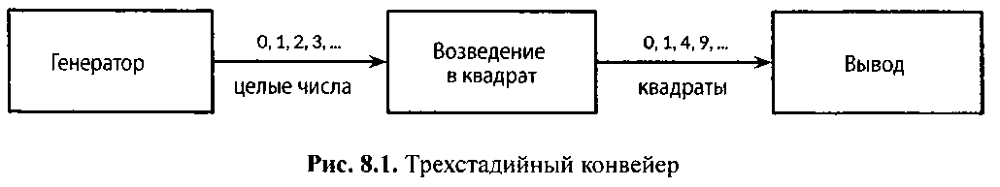

# 8.4.2 Конвейеры

Каналы могут использоваться для подключения горутин так, чтобы выход одной из них был входом для другой. Это
называется `конвейером (pipeline)`. Показанная ниже программа состоит из трех горутин, соединенных двумя каналами,
как схематически показано на рис. 8.1.



Первая программа генерирует целые числа 0, 1, 2,... и отправляет их по каналу второй горутине, которая получает
значения, возводит их в квадрат и передает по следующему каналу третьей горутине, которая выводит получаемые
значения на экран. Для ясности примера мы намеренно выбрали очень простые функции, хотя, конечно, они слишком
тривиальны, чтобы выделять их в отдельные горутины в реальной программе (см. pipeline1.go):

``` go
func main() {
	naturals := make(chan int)
	squares := make(chan int)

	// Генерация
	go func() {
		for x := 0; ; x++ {
			naturals <- x
		}
	}()

	// Возведение в квадрат
	go func() {
		for {
			x := <-naturals
			squares <- x * x
		}
	}()

	// Вывод (в главной горутине)
	for {
		fmt.Println(<-squares)
	}
}
```

Как можно ожидать, программа печатает бесконечный ряд квадратов 0, 1, 4, 9 и т.д. Конвейеры, подобные показанному, можно
найти в "долгоиграющих" серверах, где каналы используются для непрерывного взаимодействия между горутинами,
содержащими бесконечные циклы. Но что делать, если мы хотим отправить через конвейер только конечное количество
значений?
Если отправитель знает, что в канал больше не будут отправляться никакие дальнейшие значения, полезно сообщить этот факт
полу чающей горутине, чтобы она могла прекратить ожидание. Это достигается путем закрытия канала с помощью
встроенной функции `close`:

```close(naturals)```

После закрытия канала все последующие операции отправления будут вызывать аварийную ситуацию. После того как закрытый
канал опустошается, т.е. после получения последнего элемента, все последующие операции получения выполняются без
блокировки, но дают нулевые значения. Закрытие канала `naturals` выше приведет к тому, что горутина возведения в
квадрат будет нескончаемым потоком получать нулевые значения и направлять их горутине вывода.

Не существует способа непосредственно проверить, закрыт ли канал, но есть вариант операции получения, которая возвращает
два результата: **полученный из канала элемент** и **логическое значение**, условно называемое `ok`, которое
равно `true` при успешном получении значения и `false` — при получении из закрытого и опустошенного канала. Используя
эту возможность, мы можем изменить цикл в горутине возведения в квадрат так, чтобы остановить его, когда
канал `naturals` опустошается, и, в свою очередь, закрыть канал `squares`.

``` go
// Возведение в квадрат
	go func() {
		for {
			x, ok := <-naturals
			if !ok {
				break // Канал закрыт и опустошен
			}
			squares <- x * x
		}
		close(squares)
	}()
```

Из-за распространенности ситуации и неуклюжести представленного выше синтаксиса язык позволяет использовать для
получения всех значений из канала цикл по диапазону. Это более удобный синтаксис для получения всех значений,
отправленных в канал, и завершения работы после получения последнего элемента.

В показанном ниже конвейере горутина генерации заканчивает свой цикл после отправления ста элементов и закрывает
канал `naturals`. Это заставляет горутину возведения в квадрат закончить свой цикл и закрыть канал `squares`. (В
более сложной программе для функций генерации и возведения в квадрат может иметь смысл в самом начале этих функций
отложить вызов `close` с помощью ключевого слова `defer`.) Наконец главная горутина завершает свой цикл и программа
завершает работу (см. pipeline2.go).

``` go
func main() {
	naturals := make(chan int)
	squares := make(chan int)

	// Генерация
	go func() {
		for x := 0; x < 100; x++ {
			naturals <- x
		}
		close(naturals)
	}()

	// Возведение в квадрат
	go func() {
		for x := range naturals {
			squares <- x * x
		}
		close(squares)
	}()

	// Вывод (в главной горутине)
	for x := range squares {
		fmt.Println(x)
	}
}
```

Вам не нужно закрывать каждый канал по завершении работы с ним. Необходимо закрывать каналы **тогда**, когда важно
сообщить принимающей горутине, что все данные уже отправлены. Ресурсы канала, который сборщик мусора определяет как
недоступный, будут освобождены в любом случае, независимо от того, закрыт ли он. (Не путайте это с операцией закрытия
открытых файлов; вызывать метод `Close` важно для каждого файла, работа с которым завершена.)
Попытка закрыть уже закрытый канал вызывает панику, так же как и закрытие нулевого канала. Закрытие каналов
имеет и другое применение — в качестве механизма оповещения, который мы рассмотрим в разделе 8.9.

## Выводы:

* `Конвейер (pipeline)` в Go - это способ подключения горутин друг к другу с использованием каналов так, чтобы выход
  одной горутины становился входом для другой;
* Закрытие каналов при помощи функции `Close` используется для сообщения получающей горутине о том, что больше не будет
  отправляться значений;
* После закрытия канала, все последующие операции отправления вызовут **панику**, а операции получения будут возвращать
  **нулевые значения** без блокировки;
* Для определения закрытия канала используется вариант операции получения с двумя результатами: **полученный элемент** и
  **логическое значение** `ok` , которое равно `true`, если получено значение, и `false`, если канал закрыт и опустошен:
  ``` go
  x, ok := <-naturals
    if !ok {
      break // Канал закрыт и опустошен
    }
  ```
* Цикл по диапазону используется для получения всех значений из канала и автоматического завершения работы после
  получения последнего значения:
  ``` go
  for x := range naturals {
      squares <- x * x
    }
  ```
* Закрытие каналов не обязательно после завершения работы с ними, но используется при необходимости сообщить принимающей
  горутине о завершении отправки значений;
* Попытка закрыть уже закрытый или нулевой канал вызывает панику;
* Закрытие каналов может использоваться как механизм оповещения о завершении работы.