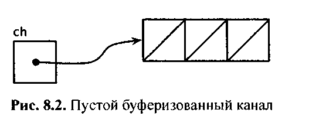
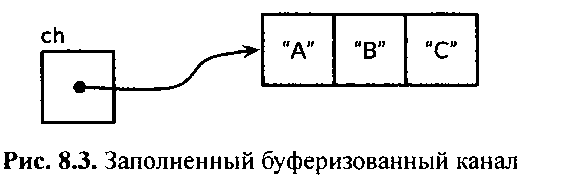

# 8.4.4 Буферизованные каналы

Буферизованный канал имеет **очередь элементов**. Максимальный размер очереди определяется при создании канала с помощью
аргумента `емкости` функции `make`. Приведенная ниже инструкция создает буферизованный канал, способный хранить три
строковых значения. На рис. 8.2 графически представлены `ch` и `канал`, на который он указывает:

``` go
ch := make(chan string, 3)
```



Операция `отправления` в буферизованный канал **вставляет отправляемый элемент в конец очереди**, а операция `получения`
**удаляет первый элемент из очереди**. Если канал заполнен, операция отправления `блокирует` свою горутину до тех
пор, пока другая горутина не освободит место, получив данные из канала. И наоборот, если канал пуст, операция получения
блокирует горутину до того момента, пока в канал не будет послано значение из другой горутины.
В указанный канал можно отправить до трех значений без блокировки горутины:

``` go
ch <- "A"
ch <- "B"
ch <- "C"
```

В этот момент канал оказывается заполненным (рис. 8.3), и инструкция отправления четвертого элемента приводит к
блокировке горутины.


``` go
fmt.Println(<-ch) // "A"
```

Если мы получим из канала одно значение, то канал станет ни пустым, ни заполненным (рис. 8.4), так что как операция
`отправления`, так и операция `получения` будут выполнены `без блокировки`. Таким образом, буфер канала разделяет
горутины отправления и получения.


В маловероятном случае, когда программе необходимо знать `емкость буфера канала`, ее можно получить, вызвав встроенную
функцию `cap`:

``` go
fmt.Println(cap(ch)) // 3
```

При применении к каналу встроенная функция `len` возвращает количество элементов, находящихся в настоящее время в
буфере. Поскольку в параллельной программе эта информация, скорее всего, окажется устаревшей сразу по получении, ее
применение ограничено, но она может оказаться полезной для оптимизации производительности или при отладке.

``` go
fmt.Println(len(ch)) // 2
```

После еще двух операций получения канал снова станет пустым, а четвертая операция заблокирует работу горутины:

``` go
fmt.Println(<-ch) // "B"
fmt.Println(<-ch) // "C"
```

В этом примере операции `отправления` и `получения` выполнялись одной и той же горутиной, но в реальных программах
они обычно выполняются различными горутинами. Новички иногда соблазняются простым синтаксисом и используют
буферизованные каналы в пределах одной горутины в качестве очереди, но это ошибка. Каналы глубоко связаны с
планированием горутин, и без другой горутины, `получающей` данные из канала, `отправитель` — да, и пожалуй, вся
программа в целом — рискует быть навсегда `заблокированным`. **Если все, что вам нужно, — это простая очередь,
воспользуйтесь срезом.**

В приведенном ниже примере показано приложение **буферизованного канала**. Оно выполняет параллельные запросы к трем
зеркалам, т.е. к эквивалентным, но географически разнесенным серверам. Их ответы отправляются в буферизованный канал, а
затем оттуда поступает только самый быстрый первый ответ. Таким образом, `mirroredQuery` возвращает результат даже до
того, как остальные медленные серверы установят соединение. (Кстати, для нескольких горутин вполне нормально
передавать значения в один и тот же канал одновременно, как в приведенном примере, как и получать данные из одного и
того же канала.)

``` go
func mirroredQuery() string {
	responses := make(chan string, 3)
	go func() { responses <-request("asia.gopl.io") } ()
	go func() { responses <-request("europe.gopl.io") } ()
	go func() { responses <-request("americas.gopl.io") } ()
	
	return <-responses // Возврат самого быстрого ответа
}

func request(hostname string) (response string) {
	/* ... */
}
```

Если бы мы использовали канал без буферизации, две более медленные горутины были бы заблокированы при попытках
отправить свои ответы в канал, из которого никто никогда не пытался бы считывать данные. Эта ситуация, которая
называется утечкой горутин, была бы ошибкой. В отличие от переменных, потерянные горутины не собираются
сборщиком мусора автоматически, поэтому важно гарантировать, что горутины должны прекратиться сами, когда они
больше не нужны.

Выбор между `буферизованными` и `небуферизованными` каналами, как и выбор `емкости` буферизованных каналов, может влиять
на корректность работы программы. `Небуферизованные` каналы дают более надежные гарантии синхронизации, потому что
**каждая операция отправления синхронизируется с соответствующей операцией получения**; в случае `буферизованных`
каналов эти операции разделены. Кроме того, когда мы знаем верхнюю границу количества значений, отправляемых в канал,
нет ничего необычного в создании буферизованного канала данного размера с выполнением всех отправлений еще до получения
первого значения из канала. Неспособность выделить достаточную емкость буфера может привести ко `взаимоблокировке`
программы.

Буферизация канала может повлиять и на производительность программы. Представьте себе трех кондитеров, из которых один
печет торт, второй поливает его глазурью, а третий разукрашивает торт перед передачей на продажу. В кухне, где мало
места, каждый кондитер, который закончил свою операцию с тортом, вынужден дожидаться, когда следующий кондитер будет
готов принять его работу. Это аналог канала связи `без буферизации`.

Если же между кондитерами `есть место для одного торта`, то кондитер может поставить там готовый торт и браться за
следующий. Это аналог канала с `буфером емкостью 1`. Если кондитеры работают в среднем примерно одинаково, большинство
тортов пройдут быстро: временные различия в работе будут сглажены наличием буфера. Чем больше места между поварами —
т.е. чем больше буфера, — тем более сильные вариации будут сглажены без приостановки конвейера (как, например, если один
повар вынужден ненадолго отлучиться, после чего наверстывает упущенное).

С другой стороны, если на более ранней стадии конвейера работа идет быстрее, чем на следующем этапе, буфер между ними
будет большую часть времени заполнен. И наоборот, если на последующей стадии работа идет быстрее, буфер в основном
пусты. В этом случае буфер не приносит никакой пользы.

Метафора такого конвейера полезна для каналов и горутин. Например, если работа на втором этапе является более
сложной, то один кондитер может не иметь возможности обеспечить необходимую скорость, так что мы могли бы нанять еще
одного кондитера ему в помощь — для выполнения той же задачи, но работающего самостоятельно. Это аналогично созданию еще
одной горутины, сообщающейся с другими через те же каналы.

Здесь недостаточно места, чтобы привести полный исходный текст, но пакет gopl.io/ch8/cake имитирует этот магазин
тортов, с несколькими параметрами, которые можно изменять. Он включает в себя функции производительности (раздел 11.4)
для нескольких сценариев, описанных выше.

## Выводы:

* Буферизованный канал имеет очередь элементов, максимальный размер которой определяется аргументом capacity функции
  make ; это позволяет хранить определенное количество элементов в канале, а не только одно значение, как в
  небуферизованных каналах. Пример создания буферизованного канала с емкостью 3:
  ``` go
  ch := make(chan string, 3)
  ```
* Операция отправления в буферизованный канал вставляет отправляемый элемент в конец очереди, а операция получения
  удаляет первый элемент из очереди; если канал заполнен, операция отправления блокирует горутину, и наоборот, если
  канал пуст, операция получения блокирует горутину. Это обеспечивает синхронизацию между горутинами, работающими с
  каналом;
* Встроенная функция `cap` позволяет получить емкость буфера канала, а функция `len` возвращает количество элементов,
  находящихся в настоящее время в буфере. Их использование может быть полезно для оптимизации производительности или при
  отладке:

``` go
fmt.Println(cap(ch)) // 3
fmt.Println(len(ch)) // 2 
```

* Не рекомендуется использовать буферизованные каналы в пределах одной горутины в качестве очереди, так как каналы
  глубоко связаны с планированием горутин и могут привести к блокировке всей программы; вместо этого используйте срезы
  для создания простой очереди;
* Буферизованные каналы могут быть использованы для ускорения обработки параллельных запросов, как в примере функции
  `mirroredQuery`, которая отправляет запросы на три сервера и возвращает результат самого быстрого первого ответа,
  игнорируя остальные медленные результаты;
* Важно предотвратить утечки горутин, так как, в отличие от переменных, они не собираются сборщиком мусора
  автоматически; нужно гарантировать, что горутины прекратятся, когда они больше не нужны, особенно когда происходит
  работа с буферизованными каналами;
* Выбор между буферизованными и небуферизованными каналами влияет на корректность работы программы; небуферизованные
  каналы обеспечивают более надежную синхронизацию, так как каждая операция отправления синхронизируется с
  соответствующей операцией получения. В случае буферизованных каналов эти операции разделены;
* В некоторых случаях можно создавать буферизованный канал определенного размера и совершать все отправления значений до
  получения первого значения из канала, особенно когда заранее известна верхняя граница отправляемых значений;
* Буферизация каналов может повышать производительность программы, если операции, выполняемые разными горутинами,
  требуют разного времени на выполнение. Буферы позволяют сглаживать временные различия и обеспечивают более плавное
  выполнение программы;
* Буферизация каналов может быть неэффективной, если одна стадия выполнения работает быстрее другой, и буфер большую
  часть времени либо заполняется, либо остается пустым;
* Если определенная стадия выполнения программы сильно сложнее и медленнее остальных, можно использовать дополнительные
  горутины для выполнения этой стадии. Это позволяет более равномерно распределить нагрузку и повысить
  производительность программы. 
* Примеры:
1. Небуферизованный канал: 
  ``` go 
  ch := make(chan int)
  ```
2. Буферизованный канал:
``` go
 ch := make(chan int, 5)
```
3. Отправка и получение данных через канал в разных горутинах:
``` go
go func() {
    ch <- someValue
}()
 go func() {
    receivedValue := <-ch
}()
```
