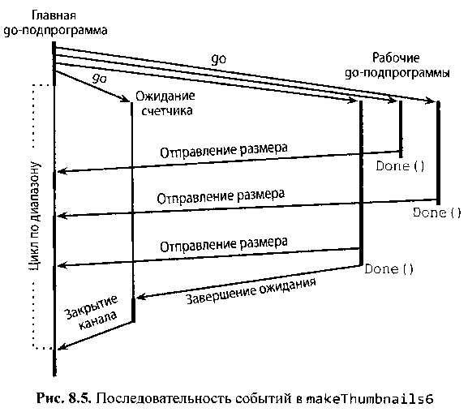

# 8.5 Параллельные циклы

В этом разделе мы рассмотрим некоторые распространенные шаблоны для **параллельного выполнения всех итераций цикла**. Мы
будем рассматривать задачу создания малых эскизов для набора полномасштабных изображений. Пакет `thumbnail` содержит
функцию `ImageFile`, которая масштабирует одно изображение. Мы не будем показывать ее реализацию, она может быть
загружена с сайта gopl.io.

```go
package thumbnail

// ImageFile считывает изображение из infile, и 
// записывает эскиз в тот же каталог.
// Возвращает сгенерированное имя файла, например "foo.thumb.jpg".
func ImageFile(infile string) (string, error)
```

Приведенная ниже программа проходит по списку имен файлов изображений и генерирует для каждого миниатюрный эскиз:

``` go
// makeThumbnails создает эскизы для файлов из списка.
func makeThumbnails(filenames []string) { 
	for _, f := range filenames {
		if err := thumbnail.ImageFile(f); err != nil { 
			log.Println(err)
		}
	}
}
```

Очевидно, что порядок, в котором обрабатываются файлы, **не имеет значения**, поскольку каждая операция масштабирования
является **независимой** от всех остальных. Подобные задачи, **которые состоят исключительно из полностью независимых
друг от друга подзадач**, описываются как `чрезвычайная параллельность (embarrassingly parallel)`. Для чрезвычайной
параллельность задач проще всего реализовать параллельное выполнение и получить производительность, которая линейно
растет с увеличением степени параллелизма.

Давайте выполним все эти операции параллельно, тем самым скрывая задержку файлового ввода-вывода и используя несколько
процессоров для масштабирования изображений. Наша первая попытка получить параллельную версию просто добавляет ключевое
слово `go`. Пока что мы будем игнорировать все возможные ошибки.

``` go
// Примечание: неправильно! 
func makeThumbnails2(filenames []string) { 
	for _, f := range filenames {
		go thumbnail.ImageFile(f) // Примечание: игнорируем ошибки
	}
}
```

Эта версия работает очень быстро, на самом деле даже слишком быстро, так как занимает куда меньше времени, чем оригинал,
даже когда срез имен файлов содержит только один элемент. Если нет параллелизма, то как же параллельная версия может
работать быстрее? Ответ прост — возврат из `makeThumbnails` выполняется до того, как выполняется все то, что эта функция
должна делать. Он запускает горутины, по одной для каждого имени файла, но не ждет их завершения.

Увы, не существует непосредственного способа дождаться завершения горутины, но мы можем изменить внутреннюю
горутину таким образом, чтобы она сообщала о своем завершении внешней горутине, отправляя событие в общий
канал. Поскольку мы знаем, что имеется ровно `len(filenames)` внутренних горутин, внешней программе нужно просто
подсчитать нужное количество событий, прежде чем завершиться:

``` go
// makeThumbnails3 параллельно делает эскизы определенных файлов.
func makeThumbnails3(filenames []string) {
	ch := make(chan struct{})
	for _, f := range filenames {
		go func(f string) {
			thumbnail.ImageFile(f) // Примечание: игнорируем ошибки
			ch <- struct{}{}
		}(f)
	}

	// Ожидаем завершения горутин
	for range filenames {
		<-ch
	}
}
```

Обратите внимание, что мы передали значение `f` как явный аргумент литеральной функции вместо того, чтобы использовать
объявление `f` из охватывающего цикла `for`:

``` go
for _, f := range filenames {
		go func(f string) {
			thumbnail.ImageFile(f) // Примечание: игнорируем ошибки
			ch <- struct{}{}
		}(f)
	}
```

Вспомните о проблеме `захвата переменной цикла внутри анонимной функции`, описанной в разделе 5.6.1. Выше одна
переменная `f` разделяется всеми значениями — анонимными функциями и обновляется каждой очередной итерацией. Ко времени,
когда новая горутина начинает выполнение литеральной функции, цикл, возможно, уже обновил `f` и начал другую
итерацию или (что даже более вероятно) завершился полностью, так что, когда эти горутины добрались до чтения
значения `f`, все они увидели значение для последнего элемента среза. Используя явный параметр, **мы гарантируем, что
применяется значение `f`, которое является текущим в момент выполнения инструкции** `go`.

Что делать, если мы хотим возвращать значения от каждой рабочей горутины в главную? Если вызову `thumbnail.ImageFile` не
удается создать файл, он возвращает сообщение об ошибке. Следующая версия `makeThumbnails` возвращает первую
ошибку, которую она получает от любой из операций масштабирования:

``` go
// makeThumbnails4 параллельно делает эскизы определенных файлов.
// Возвращает ошибку при сбое на любом шаге.
func makeThumbnails4(filenames []string) error {
	errors := make(chan error)

	for _, f := range filenames {
		go func(f string) {
			_, err := thumbnail.ImageFile(f)
			errors <- err
		}(f)
	}

	for range filenames {
		if err := <-errors; err != nil {
			return err // Примечание: неверно: утечка горутин
		}
	}

	return nil
}
```

В этой функции содержится тонкая ошибка. Встретив первую ненулевую ошибку, она возвращает ее вызывающей функции, не
позволяя горутине опустошить канал `errors`. В результате каждая оставшаяся работающая горутина будет
навсегда заблокирована, если попытается отправить значение в этот канал, и никогда не завершится. Эта ситуация, утечка
горутин (раздел 8.4.4), может привести к остановке всей программы или нехватке памяти.

Самым простым решением является использование буферизованного канала с достаточной емкостью, который не будет
блокировать рабочие горутины при отправке сообщений. (Альтернативное решение заключается в создании еще одной
горутины для опустошения канала, в то время как основная горутина без промедления возвращает первую
ошибку.)

Очередная версия `makeThumbnails` использует буферизованный канал для возврата имен сгенерированных файлов вместе со
всеми ошибками.

``` go
// makeThumbnails5 параллельно делает эскизы определенных файлов.
// Возвращает имена сгенерированных файлов в произвольном порядке
// или ошибку при сбое на любом шаге.
func makeThumbnails5(filenames []string) (thumbfiles []string, err error) {
	type item struct {
		thumbfile string
		err       error
	}

	ch := make(chan item, len(filenames))
	for _, f := range filenames {
		go func(f string) {
			var it item
			it.thumbfile, it.err = thumbnail.ImageFile(f)
			ch <- it
		}(f)
	}

	for range filenames {
		it := <-ch
		if it.err != nil {
			return nil, it.err
		}
		thumbfiles = append(thumbfiles, it.thumbfile)
	}

	return thumbfiles, nil
}
```

Наша окончательная версия `makeThumbnails`, показанная ниже, возвращает общее количество байтов, занятых новыми файлами.
Однако в отличие от предыдущих версий, она получает имена файлов не как срез, а по каналу строк, поэтому мы не можем
предсказать количество итераций цикла.

Чтобы узнать, когда последняя горутина закончит работу (эта горутина может не быть последней из запущенных на
выполнение), нужно увеличивать счетчик перед запуском каждой горутины и уменьшать его после завершения. Для этого
требуется счетчик особого рода, с которым **могут безопасно работать несколько горутин и который предоставляет
возможность ожидания, пока он не станет равным нулю**. Этот тип счетчика известен как `sync.WaitGroup`, и приведенный
ниже код показывает, как его использовать:

``` go
// makeThumbnails6 параллельно делает эскизы определенных файлов.
// Возвращает общее количество байтов в созданных файлах,
func makeThumbnails6(filenames <-chan string) int64 {
	sizes := make(chan int64)
	var wg sync.WaitGroup // Количество работающих горутин
	for f := range filenames {
		wg.Add(1)
		// Рабочая горутина
		go func(f string) {
			defer wg.Done()
			thumb, err := thumbnail.ImageFile(f)
			if err != nil {
				log.Println(err)
				return
			}
			info, _ := os.Stat(thumb) // Игнорируем ошибки
			sizes <- info.Size()
		}(f)
	}

	// Ожидание счетчика
	go func() {
		wg.Wait()
		close(sizes)
	}()

	var total int64
	for size := range sizes {
		total += size
	}
	return total
}
```

Обратите внимание на асимметрию методов `Add` и `Done`. Метод `Add`, который увеличивает значение счетчика, должен быть
вызван перед началом рабочей горутины, но не внутри нее; в противном случае мы не можем быть уверены, что `Add`
предшествует горутине ожидания счетчика, которая вызывает метод `Wait`. Кроме того, `Add` принимает параметр, a
`Done` — нет; вызов последнего метода эквивалентен вызову `Add(-1)`. Мы использовали `defer`, чтобы гарантировать, что
значение счетчика уменьшается даже в случае ошибки. Показанная структура кода является распространенным идиоматическим
шаблоном для параллельно выполняемых циклов, когда мы не знаем количества итераций заранее.

Канал `sizes` передает размер каждого файла обратно в главную горутину, которая получает эти значения с помощью
цикла по диапазону и вычисляет сумму. Обратите внимание, как мы создаем горутину ожидания счетчика, которая ждет
завершения всех рабочих горутин. Эти две операции, ожидания счетчика и закрытия канала, должны выполняться
параллельно с циклом, работающим с каналом `sizes`. Рассмотрим альтернативы: если операция ожидания находится в главной
горутине перед циклом, она никогда не завершится, а если ее поместить после цикла, она окажется недоступной,
поскольку ничто не закроет канал, а значит, цикл никогда не прекратится.

На рис. 8.5 показана последовательность событий в функции `makeThumbnails6`. Вертикальные линии представляют
горутины. Тонкие отрезки указывают периоды ожидания, толстые — деятельности. Наклонные стрелки указывают события,
которые синхронизируют одну горутину с другой. Ось времени направлена вниз. Обратите внимание, как главная
горутина проводит большую часть своего времени в цикле по диапазону в состоянии ожидания, пока рабочая горутина не
отправит значение, или горутина ожидания счетчика не закроет канал.



## Выводы:

* При работе с параллельными циклами в Golang можно использовать `горутины` для выполнения независимых операций в
  параллельных потоках, что увеличивает производительность и эффективность программы; `go func()`
* В задачах с `чрезвычайной параллельностью`, **когда все подзадачи полностью независимы друг от друга**, можно
  реализовать параллельное выполнение и получить линейное увеличение производительности с увеличением
  степени параллелизма;
* Для ожидания завершения горутины можно использовать `канал`, в который каждая горутина отправляет `событие` о своем
  завершении, а `главная горутина` подсчитывает количество полученных событий и завершается после обработки всех
  подзадач; `var ch = make(chan struct{}); /*...*/ ch <- struct{}{}` в горутине;
* При использовании `анонимных функций внутри цикла` стоит быть осторожным с захватом переменных цикла и передавать их
  как `явные аргументы функции`, чтобы избежать ошибок и неожиданного поведения программы;
   ``` go
    var i = make(chan int)
    for j:=0; j<10; j++ {
      go func(a int) {
        i <- a * 2
      }(j)
    }
    ```
* Если нужно возвращать значения от рабочих горутин в главную горутину, можно использовать `каналы` для передачи
  результатов или ошибок;
* Важно избегать утечек горутин, когда горутина `навсегда заблокирована` **в ожидании отправки значения в канал**, так
  как это может привести к остановке программы или нехватке памяти, для этого рекомендуется
  использовать `буферизованные каналы` с достаточной емкостью, что предотвращает блокировку рабочих горутин при отправке
  сообщений;
* Использование типа `sync.WaitGroup` позволяет обеспечить безопасное ожидание завершения работы
  **всех горутин перед закрытием канала**, а также позволяет работать с `переменной-счетчиком`, доступной для нескольких
  горутин одновременно;
  ``` go
  var wg sync.WaitGroup
  ```
* Для корректного использования `sync.WaitGroup` следует вызывать метод `Add` **перед началом рабочей горутины**, а
  метод `Done` (или `Add(-1)`) **внутри рабочей горутины**, что гарантирует правильное состояние счетчика в процессе
  работы программы;
* Использование оператора `defer` внутри рабочей горутины с методом `Done()` обеспечивает **уменьшение значения счетчика
  и завершение работы горутины даже в случае возникновения ошибки**;
* Создание параллельной горутины для ожидания завершения всех рабочих горутин и последующем закрытии канала обеспечивает
  правильное выполнение программы без блокировок и зависаний;
  ``` go
  // Ожидание счетчика
  go func() {
      wg.Wait()
      close(sizes)
  }() 
  ```
* При использовании параллельных циклов в Go стоит следить за **последовательностью вызовов и взаимодействиями между
  горутинами и счетчиками**, что позволит предотвратить возможные блокировки, ошибки или некорректное выполнение
  программы;
* Польза использования параллельных циклов заключается в **улучшении производительности программы, эффективном
  использовании ресурсов и возможности обеспечения безопасной работы** с общими переменными при помощи каналов и
  синхронизации работы горутин.